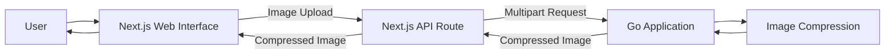

# Go Image Optimizer

An image optimization application built with Go, with a web interface using Next.js, React, and Tailwind CSS.

The project is being developed incrementally, starting with a synchronous compression workflow and evolving its architecture as new requirements and technical challenges emerge.

> **Current status:** The compression flow is implemented for JPEG/JPG, PNG, WebP, AVIF, HEIC/HEIF, GIF, BMP, and TIFF.

## Overview

Go Image Optimizer is a portfolio project focused on exploring image processing while applying backend engineering concepts with Go.

Instead of designing a complex architecture upfront, the project follows an incremental approach: start with a simple solution, validate the requirements, and introduce architectural changes when there is a concrete reason for them.

## Initial Scope

The current feature allows users to:

- Upload an image through the web interface.
- Send the image to the Go backend.
- Compress the image.
- Receive the compressed image as the result.
- Download the compressed image directly from the browser.

The backend detects the real image format from file bytes rather than trusting extensions or browser MIME labels. The application returns the same image format family it receives, preserves dimensions, and does not promise every output will be smaller.

Additional image optimization capabilities will be introduced incrementally as the project evolves.

## Supported Formats

| Format | Output behavior | Notes |
| --- | --- | --- |
| JPEG / JPG | JPEG | Lossy re-encode at conservative quality. EXIF orientation is applied to pixels before output. |
| PNG | PNG | Lossless pixel output using high PNG compression. Transparency is preserved. |
| WebP | WebP | Static and animated WebP are supported. Animated output preserves frame count and timing while re-encoding reconstructed frames. |
| AVIF | AVIF | Static AVIF is supported. The implementation uses the AVIF multi-image API, but current automated coverage uses static fixtures. |
| HEIC / HEIF | HEIC / HEIF family | Uses native libheif/HEVC support in the backend container. Unsupported HEIF variants are rejected instead of being faked. |
| GIF | GIF | Static and animated GIF are supported, including frame delays and loop settings. |
| BMP | BMP | Decoded and re-encoded as BMP; size reduction is not guaranteed. |
| TIFF | TIFF | Re-encoded as TIFF with Deflate compression. |

WebM, SVG, RAW camera formats, videos, and archives are intentionally not supported.

## Tech Stack

### Backend

- Go
- Native libheif runtime libraries for HEIC/HEIF support in Docker

### Frontend

- Next.js
- React
- Tailwind CSS

## Architecture

The initial architecture intentionally keeps image processing within the Go application.



This architecture is intentionally simple. The current request lifecycle is ephemeral: uploaded and compressed images are not persisted by the backend. New components or services will only be introduced when requirements or observed limitations justify the additional complexity.

For architectural decisions and trade-offs, see [Architecture](docs/en/architecture.md). For container-specific notes, see [Docker](docs/en/docker.md).

## Documentation

- [Architecture](docs/en/architecture.md)
- [Docker](docs/en/docker.md)
- [ADR 001: Native Image Codecs](docs/en/adr-001-native-image-codecs.md)
- [Arquitetura - Português](docs/pt-BR/architecture.md)
- [Test Documentation](TESTS_README.md)
- [Documentação de Testes - Português](TESTS_README.pt-BR.md)
- [README — Português](README.pt-BR.md)

## Testing

After the test image has been built, run backend tests with native codec support:

```bash
docker compose run --rm backend-test
```

The backend test suite includes deterministic synthetic tests and real image fixtures from `storage/testdata/images`.

## Roadmap

The project will evolve incrementally.

Implemented:

- Image compression for JPEG/JPG, PNG, WebP, AVIF, HEIC/HEIF, GIF, BMP, and TIFF

Future / considered:

- Image resizing
- Image format conversion
- Thumbnail generation
- Processing history

The roadmap represents the intended direction of the project and may change as implementation decisions and technical requirements evolve.

## License

No license has been defined for this project yet.
