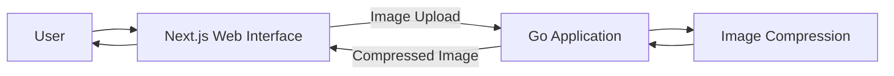

# Go Image Optimizer

An image optimization application built with Go, with a web interface using Next.js, React, and Tailwind CSS.

The project is being developed incrementally, starting with a synchronous JPEG/PNG compression workflow and evolving its architecture as new requirements and technical challenges emerge.

> **Current status:** The first usable image compression flow is implemented for JPEG/JPG and PNG.

## Overview

Go Image Optimizer is a portfolio project focused on exploring image processing while applying backend engineering concepts with Go.

Instead of designing a complex architecture upfront, the project follows an incremental approach: start with a simple solution, validate the requirements, and introduce architectural changes when there is a concrete reason for them.

## Initial Scope

The current feature allows users to:

- Upload an image through the web interface.
- Send the image to the Go backend.
- Compress the image.
- Receive the compressed image as the result.
- Download the compressed image directly from the browser.

JPEG compression uses conservative lossy re-encoding. PNG compression is lossless for pixel content. The application preserves image dimensions and format for supported files, but it does not promise every output will be smaller.

Additional image optimization capabilities will be introduced incrementally as the project evolves.

## Tech Stack

### Backend

- Go

### Frontend

- Next.js
- React
- Tailwind CSS

## Architecture

The initial architecture intentionally keeps image processing within the Go application.

This architecture is intentionally simple. The current request lifecycle is ephemeral: uploaded and compressed images are not persisted by the backend. New components or services will only be introduced when requirements or observed limitations justify the additional complexity.

For architectural decisions and trade-offs, see [Architecture](docs/en/architecture.md).

## Documentation

- [Architecture](docs/en/architecture.md)
- [Arquitetura - Português](docs/pt-BR/architecture.md)
- [Test Documentation](TESTS_README.md)
- [Documentação de Testes - Português](TESTS_README-ptBR.md)
- [README — Português](README.pt-BR.md)

## Roadmap

The project will evolve incrementally. Planned capabilities include:

- Image compression for JPEG/JPG and PNG
- Image resizing
- Image format conversion
- WebP and AVIF output
- Thumbnail generation
- Processing history

The roadmap represents the intended direction of the project and may change as implementation decisions and technical requirements evolve.

## License

No license has been defined for this project yet.
