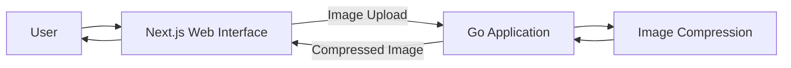

# Go Image Optimizer

An image optimization application built with Go, with a web interface using Next.js, React, and Tailwind CSS.

The project is being developed incrementally, starting with image compression and evolving its architecture as new requirements and technical challenges emerge.

> **Current status:** Initial development. The first planned feature is image compression.

## Overview

Go Image Optimizer is a portfolio project focused on exploring image processing while applying backend engineering concepts with Go.

Instead of designing a complex architecture upfront, the project follows an incremental approach: start with a simple solution, validate the requirements, and introduce architectural changes when there is a concrete reason for them.

## Initial Scope

The first feature will allow users to:

- Upload an image through the web interface.
- Send the image to the Go backend.
- Compress the image.
- Receive the compressed image as the result.

Additional image optimization capabilities will be introduced incrementally as the project evolves.

## Tech Stack

### Backend

- Go

### Frontend

- Next.js
- React
- Tailwind CSS

## Architecture

The initial architecture intentionally keeps image processing within the Go application.

This architecture is intentionally simple. New components or services will only be introduced when requirements or observed limitations justify the additional complexity.

For architectural decisions and trade-offs, see [Architecture](docs/architecture.md).

## Documentation

- [Architecture](docs/architecture.md)
- [Arquitetura — Português](docs/architecture.pt-BR.md)
- [README — Português](README.pt-BR.md)

## Roadmap

The project will evolve incrementally. Planned capabilities include:

- Image compression
- Image resizing
- Image format conversion
- WebP and AVIF output
- Thumbnail generation
- Original vs. optimized file size comparison
- Processing history

The roadmap represents the intended direction of the project and may change as implementation decisions and technical requirements evolve.

## License

No license has been defined for this project yet.
