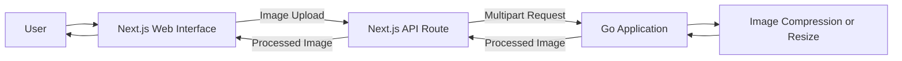

# Go Image Optimizer

An image optimization application built with Go, with a web interface using Next.js, React, and Tailwind CSS.

Compression and Resize run synchronously, returning processed images directly to the browser.

> **Current status:** Compression and Image Resize are implemented. Resize supports pixels and percentage modes; see [Resize behavior and supported variants](docs/en/architecture.md#image-resize).

## Overview

Go Image Optimizer is a portfolio project focused on exploring image processing while applying backend engineering concepts with Go.

Instead of designing a complex architecture upfront, the project follows an incremental approach: start with a simple solution, validate the requirements, and introduce architectural changes when there is a concrete reason for them.

## Current Scope

The application allows users to:

- Upload an image through the web interface.
- Send the image to the Go backend.
- Compress the image or configure Resize by pixels/percentage in a modal.
- Receive the processed image with measured result information.
- Download the result directly from the browser.

The backend detects the real image format from file bytes rather than trusting extensions or browser MIME labels. The application returns the same image format family it receives, preserves dimensions during compression, and changes them explicitly during Resize. Neither operation promises every output will be smaller.

Additional image optimization capabilities will be introduced incrementally as the project evolves.

## Compression Formats

| Format      | Output behavior    | Notes                                                                                                                            |
| ----------- | ------------------ | -------------------------------------------------------------------------------------------------------------------------------- |
| JPEG / JPG  | JPEG               | Lossy re-encode at conservative quality. EXIF orientation is applied to pixels before output.                                    |
| PNG         | PNG                | Lossless pixel output using high PNG compression. Transparency is preserved.                                                     |
| WebP        | WebP               | Static and animated WebP are supported. Animated output preserves frame count and timing while re-encoding reconstructed frames. |
| AVIF        | AVIF               | Static AVIF is supported. The implementation uses the AVIF multi-image API, but current automated coverage uses static fixtures. |
| HEIC / HEIF | HEIC / HEIF family | Uses native libheif/HEVC support in the backend container. Unsupported HEIF variants are rejected instead of being faked.        |
| GIF         | GIF                | Static and animated GIF are supported, including frame delays and loop settings.                                                 |
| BMP         | BMP                | Decoded and re-encoded as BMP; size reduction is not guaranteed.                                                                 |
| TIFF        | TIFF               | Re-encoded as TIFF with Deflate compression.                                                                                     |

WebM, SVG, RAW camera formats, videos, and archives are intentionally not supported.

## Tech Stack

### Backend

- Go
- Native libheif runtime libraries for HEIC/HEIF support in Docker

### Frontend

- Next.js
- React
- Tailwind CSS

## Architecture

The current architecture intentionally keeps image processing within the Go application.


```mermaid
flowchart LR
    U[User] --> F[Next.js Web Interface]
    F -->|Image Upload| N[Next.js API Route]
    N -->|Multipart Request| API[Go Application]
    API --> C[Image Compression or Resize]
    C --> API
    API -->|Processed Image| N
    N -->|Processed Image| F
    F --> U
```

This architecture is intentionally simple. The current request lifecycle is ephemeral: uploaded and processed images are not persisted by the backend. New components or services will only be introduced when requirements or observed limitations justify the additional complexity.

For architectural decisions and trade-offs, see [Architecture](docs/en/architecture.md). For container-specific notes, see [Docker](docs/en/docker.md).

## Documentation

- [Architecture](docs/en/architecture.md)
- [Image Resize: UX, API, behavior, and limitations](docs/en/architecture.md#image-resize)
- [Docker](docs/en/docker.md)
- [ADR 001: Native Image Codecs](docs/en/adr-001-native-image-codecs.md)
- [Arquitetura - Português](docs/pt-BR/architecture.md)
- [Test Documentation](TESTS_README.md)
- [Documentação de Testes - Português](TESTS_README.pt-BR.md)
- [README — Português](README.pt-BR.md)

## Testing

After the test image has been built, run backend tests with native codec support:

```bash
docker compose run --rm backend-test
```

The backend test suite includes deterministic synthetic tests and real image fixtures from `storage/testdata/images`.

## Docker Workflows

Docker and Docker Compose are the only host requirements; Node.js and npm run inside the frontend container.

Start the frontend development server and backend with live-mounted frontend source:

```bash
docker compose --profile dev up frontend-dev
```

Open `http://localhost:3000`. Changes to frontend TypeScript, TSX, CSS, and related source files are detected by Next.js development mode without rebuilding the image. See the Docker guide for the dependency-volume refresh command required when `package.json` or `package-lock.json` changes.

Validate the production frontend build entirely through Docker:

```bash
docker compose build frontend
```

The normal production-style application remains separate:

```bash
docker compose up --build backend frontend
```

See [Docker](docs/en/docker.md) for details.

## Roadmap

The project will evolve incrementally.

Implemented:

- Image compression for JPEG/JPG, PNG, WebP, AVIF, HEIC/HEIF, GIF, BMP, and TIFF

- Image resizing by pixels or percentage, with a dedicated configuration modal

Future / considered:
- Image format conversion
- Thumbnail generation
- Processing history

The roadmap represents the intended direction of the project and may change as implementation decisions and technical requirements evolve.

## License

This project is licensed under the MIT License. See the `LICENSE` file for details.

## Format conversion

Select an image, choose **Convert format**, and click **Run** to configure conversion. Byte-based inspection reports the actual source family and oriented dimensions. **Convert image** preserves dimensions and leaves the original selected. Results show source/output formats, measured sizes, reduction, increase or no size change, a preview fallback, and a download of the converted bytes even when larger.

Verified outputs: JPEG (JPG), PNG, WebP, AVIF, HEIC/HEIF (HEVC), GIF, BMP and TIFF. Aliases are not separate algorithms. The source family is disabled and rejected server-side. All animated conversions are rejected; no animation pair is offered. APNG, AVIF sequences and multi-image TIFF/HEIF are also rejected by the shared inspection rules.

JPEG, BMP and HEIC composite transparency onto white. PNG, WebP, AVIF and TIFF preserve alpha; GIF uses the WebSafe palette and binary transparency (50% threshold), which can lose colors and partial alpha. Defaults: JPEG/WebP quality 82, WebP method 4/alpha 100, AVIF quality 60/alpha 100/speed 6, HEVC quality 60, PNG best compression, TIFF Deflate with predictor. Metadata and color profiles are not universally preserved. Orientation follows the shared decoder: normalized JPEG EXIF, AVIF autorotation and codec-applied HEIF transformations; other static formats apply EXIF orientation when recognized by the installed metadata reader. No new native codecs are introduced.

`POST /images/convert` (same-origin proxy `POST /api/images/convert`) accepts exactly one multipart file `image` and one `targetFormat`: `jpeg`, `png`, `webp`, `avif`, `heif`, `gif`, `bmp` or `tiff`. Extra fields, duplicates and same-family targets return 400. Unsupported variants return 422. `POST /images/convert/info` (proxy `/api/images/convert/info`) accepts only `image` and returns `width`, `height`, `format`, `contentType`, and `frameCount`.

Success returns encoded bytes, correct Content-Type/Length, sanitized Content-Disposition with `_converted` and destination extension, Cache-Control no-store, and X-Source-Format, X-Output-Format, X-Original-Width/Height and X-Image-Width/Height headers. Limits: 50 MiB request body, 32 million pixels, 64 million cumulative animation canvas pixels during inspection, and 50 MiB output. Output size is checked after encoding; encoder transient memory is codec-dependent. Processing remains synchronous and stateless, including cleanup of temporary HEIF files.

## Image previews

Uploads, Resize/Convert settings and all result dialogs first try native browser image loading. Display-only MIME correction handles mislabeled JPEG, PNG, GIF, WebP and AVIF bytes without changing the source. If loading fails, the shared component posts the actual File or processed result Blob to the same-origin `/api/images/preview` proxy and Go `POST /images/preview` endpoint (exactly one multipart file named `image`).

The stateless endpoint reuses processing detection, decoding, orientation and resource/variant checks. It returns an aspect-ratio-preserving thumbnail bounded by 1200 × 1200, without cropping or enlargement: PNG for transparency, JPEG for opaque pixels, with the corresponding Content-Type and `Cache-Control: no-store`. Supported static JPEG, PNG, WebP, AVIF, HEIC/HEIF, GIF, BMP and single-page TIFF inputs can use the fallback. Animations, APNG, AVIF sequences, multipage TIFF and unsupported multi-image HEIF remain explicit unsupported previews; RAW remains unsupported. Native browser previews may still display variants that the fallback rejects.

Loading, errors and **Retry preview** remain within the preview area. Failures do not block operations or downloads. Generated bytes are cached by source Blob identity for the session, concurrent requests are shared, obsolete requests are aborted when their last consumer leaves, stale responses are ignored and display Object URLs are revoked. The cache keeps bytes, not long-lived Object URLs. Original upload bytes and actual processed results remain separate from display-only bytes; downloads, names, formats, sizes and reported dimensions describe the actual files, never the thumbnail. Reloading clears the cache.
