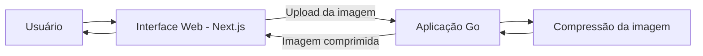

# Go Image Optimizer

Aplicação para otimização de imagens desenvolvida em Go, com uma interface web utilizando Next.js, React e Tailwind CSS.

O projeto será desenvolvido de forma incremental, começando por um fluxo síncrono de compressão para JPEG/PNG e evoluindo sua arquitetura conforme novos requisitos e desafios técnicos surgirem.

> **Status atual:** O primeiro fluxo utilizável de compressão de imagens está implementado para JPEG/JPG e PNG.

## Visão geral

O Go Image Optimizer é um projeto de portfólio voltado ao processamento de imagens e à aplicação de conceitos de engenharia de backend utilizando Go.

Em vez de definir uma arquitetura complexa antecipadamente, o projeto segue uma abordagem incremental: começar com uma solução simples, validar os requisitos e introduzir mudanças arquiteturais quando existir uma razão concreta para isso.

## Escopo inicial

A funcionalidade atual permite:

- Enviar uma imagem pela interface web.
- Enviar essa imagem para o backend em Go.
- Comprimir a imagem.
- Receber a imagem comprimida como resultado.
- Baixar a imagem comprimida diretamente pelo navegador.

A compressão JPEG usa re-encoding lossy conservador. A compressão PNG é lossless para o conteúdo dos pixels. A aplicação preserva as dimensões e o formato dos arquivos suportados, mas não promete que toda saída ficará menor.

Outras funcionalidades de otimização serão adicionadas gradualmente conforme o projeto evoluir.

## Tecnologias

### Backend

- Go

### Frontend

- Next.js
- React
- Tailwind CSS

## Arquitetura

A arquitetura inicial mantém, propositalmente, o processamento da imagem dentro da aplicação Go.

Essa arquitetura é intencionalmente simples. O ciclo de vida atual da requisição é efêmero: imagens enviadas e comprimidas não são persistidas pelo backend. Novos componentes ou serviços serão introduzidos somente quando requisitos ou limitações observadas justificarem a complexidade adicional.

Para conhecer as decisões arquiteturais e seus trade-offs, consulte [Arquitetura](docs/pt-BR/architecture.md).

## Documentação

- [Architecture - English](docs/en/architecture.md)
- [Arquitetura](docs/pt-BR/architecture.md)
- [Test Documentation - English](TESTS_README.md)
- [Documentação de Testes](TESTS_README-ptBR.md)
- [README — English](README.md)

## Roadmap

O projeto será desenvolvido de forma incremental. Entre as funcionalidades planejadas estão:

- Compressão de imagens JPEG/JPG e PNG
- Redimensionamento
- Conversão de formatos
- Geração de WebP e AVIF
- Geração de thumbnails
- Histórico de processamentos

O roadmap representa a direção pretendida para o projeto e poderá mudar conforme as decisões de implementação e os requisitos técnicos evoluírem.

## Licença

Nenhuma licença foi definida para este projeto até o momento.
