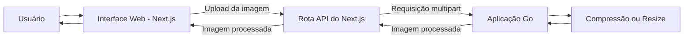

# Go Image Optimizer

Aplicação para otimização de imagens desenvolvida em Go, com uma interface web utilizando Next.js, React e Tailwind CSS.

O projeto será desenvolvido de forma incremental, começando por um fluxo síncrono de compressão e evoluindo sua arquitetura conforme novos requisitos e desafios técnicos surgirem.

> **Status atual:** Compressão e redimensionamento estão implementados. Resize oferece pixels e porcentagem; consulte [comportamento e variantes suportadas](docs/pt-BR/resize.md).

## Visão geral

O Go Image Optimizer é um projeto de portfólio voltado ao processamento de imagens e à aplicação de conceitos de engenharia de backend utilizando Go.

Em vez de definir uma arquitetura complexa antecipadamente, o projeto segue uma abordagem incremental: começar com uma solução simples, validar os requisitos e introduzir mudanças arquiteturais quando existir uma razão concreta para isso.

## Escopo atual

A aplicação permite:

- Enviar uma imagem pela interface web.
- Enviar essa imagem para o backend em Go.
- Comprimir a imagem ou configurar Resize por pixels/porcentagem em um modal.
- Receber a imagem processada com informações reais do resultado.
- Baixar o resultado diretamente pelo navegador.

O backend identifica o formato real da imagem pelos bytes do arquivo, sem confiar em extensão ou MIME type informado pelo navegador. A aplicação devolve a mesma família de formato recebida, preserva dimensões na compressão e as altera explicitamente no Resize. Nenhuma operação promete que toda saída ficará menor.

Outras funcionalidades de otimização serão adicionadas gradualmente conforme o projeto evoluir.

## Formatos de compressão

| Formato     | Saída               | Observações                                                                                                                           |
| ----------- | ------------------- | ------------------------------------------------------------------------------------------------------------------------------------- |
| JPEG / JPG  | JPEG                | Re-encode lossy com qualidade conservadora. A orientação EXIF é aplicada aos pixels antes da saída.                                   |
| PNG         | PNG                 | Saída lossless para pixels usando compressão PNG alta. Transparência é preservada.                                                    |
| WebP        | WebP                | WebP estático e animado são suportados. A saída animada preserva quantidade de frames e tempos, reencodando frames reconstruídos.     |
| AVIF        | AVIF                | AVIF estático é suportado. A implementação usa a API multi-imagem de AVIF, mas a cobertura automatizada atual usa fixtures estáticas. |
| HEIC / HEIF | Família HEIC / HEIF | Usa libheif/HEVC nativo no container do backend. Variantes HEIF não suportadas são rejeitadas em vez de simuladas.                    |
| GIF         | GIF                 | GIF estático e animado são suportados, incluindo delays e configuração de loop.                                                       |
| BMP         | BMP                 | Decodificado e reencodado como BMP; redução de tamanho não é garantida.                                                               |
| TIFF        | TIFF                | Reencodado como TIFF com compressão Deflate.                                                                                          |

WebM, SVG, formatos RAW de câmera, vídeos e arquivos compactados não são suportados.

## Tecnologias

### Backend

- Go
- Bibliotecas nativas libheif no runtime Docker para suporte a HEIC/HEIF

### Frontend

- Next.js
- React
- Tailwind CSS

## Arquitetura

A arquitetura inicial mantém, propositalmente, o processamento da imagem dentro da aplicação Go.



Essa arquitetura é intencionalmente simples. O ciclo de vida atual da requisição é efêmero: imagens enviadas e processadas não são persistidas pelo backend. Novos componentes ou serviços serão introduzidos somente quando requisitos ou limitações observadas justificarem a complexidade adicional.

Para conhecer as decisões arquiteturais e seus trade-offs, consulte [Arquitetura](docs/pt-BR/architecture.md). Para detalhes de container, consulte [Docker](docs/pt-BR/docker.md).

## Documentação

- [Architecture - English](docs/en/architecture.md)
- [Arquitetura](docs/pt-BR/architecture.md)
- [Resize: UX, API, comportamento e limitações](docs/pt-BR/resize.md)
- [Docker](docs/pt-BR/docker.md)
- [ADR 001: Codecs nativos de imagem](docs/pt-BR/adr-001-codecs-nativos.md)
- [Test Documentation - English](TESTS_README.md)
- [Documentação de Testes](TESTS_README.pt-BR.md)
- [README — English](README.md)

## Testes

Depois que a imagem de teste for construída, execute os testes do backend com suporte aos codecs nativos:

```bash
docker compose run --rm backend-test
```

A suíte de backend inclui testes sintéticos determinísticos e fixtures reais de imagem em `storage/testdata/images`.

## Fluxos com Docker

Docker e Docker Compose são os únicos requisitos no host; Node.js e npm rodam dentro do container do frontend.

Inicie o servidor de desenvolvimento do frontend e o backend com o código-fonte do frontend montado:

```bash
docker compose --profile dev up frontend-dev
```

Acesse `http://localhost:3000`. Alterações em TypeScript, TSX, CSS e arquivos relacionados do frontend são detectadas pelo modo de desenvolvimento do Next.js sem reconstruir a imagem. Consulte o guia Docker para o comando de atualização do volume de dependências necessário quando `package.json` ou `package-lock.json` mudar.

Valide o build de produção do frontend inteiramente via Docker:

```bash
docker compose build frontend
```

A execução normal da aplicação em modo de produção permanece separada:

```bash
docker compose up --build backend frontend
```

Consulte [Docker](docs/pt-BR/docker.md) para mais detalhes.

## Roadmap

O projeto será desenvolvido de forma incremental.

Implementado:

- Compressão de imagens JPEG/JPG, PNG, WebP, AVIF, HEIC/HEIF, GIF, BMP e TIFF

- Redimensionamento por pixels ou porcentagem em modal próprio

Futuro / considerado:
- Conversão de formatos
- Geração de thumbnails
- Histórico de processamentos

O roadmap representa a direção pretendida para o projeto e poderá mudar conforme as decisões de implementação e os requisitos técnicos evoluírem.

## Licença

Este projeto é licenciado sob a MIT License. Consulte o arquivo `LICENSE` para mais detalhes.
