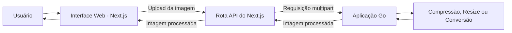

# Go Image Optimizer

Aplicação para otimização de imagens desenvolvida em Go, com uma interface web utilizando Next.js, React e Tailwind CSS.

Compressão, Resize e conversão são síncronos e devolvem as imagens processadas diretamente ao navegador. Prévias nativas contam com fallback gerado pelo servidor.

> **Status atual:** Completo para o escopo funcional atual: compressão, redimensionamento, conversão de formatos e fallback de prévia compatível com navegadores. Não há funcionalidades adicionais planejadas neste momento. Manutenção e correções continuam possíveis; isso não significa prontidão para produção.

## Visão geral

O Go Image Optimizer é um projeto de portfólio voltado ao processamento de imagens e à aplicação de conceitos de engenharia de backend utilizando Go.

Em vez de definir uma arquitetura complexa antecipadamente, o projeto segue uma abordagem incremental: começar com uma solução simples, validar os requisitos e introduzir mudanças arquiteturais quando existir uma razão concreta para isso.

## Escopo atual

A aplicação permite:

- Enviar uma imagem pela interface web.
- Enviar essa imagem para o backend em Go.
- Comprimir, configurar Resize por pixels/porcentagem ou converter o formato em um modal.
- Visualizar imagens suportadas pelo navegador ou pelo fallback apenas para exibição.
- Receber a imagem processada com informações reais do resultado.
- Baixar o resultado diretamente pelo navegador.

O backend identifica o formato real da imagem pelos bytes do arquivo, sem confiar em extensão ou MIME type informado pelo navegador. Compressão e Resize mantêm a família de origem. A compressão preserva dimensões orientadas, Resize as altera explicitamente e a conversão preserva dimensões orientadas ao mudar a família. Nenhuma operação garante um arquivo menor.

O escopo é deliberadamente focado em um portfólio Go e Next.js. Resize atende à necessidade básica de imagens menores. Operação separada de thumbnails, histórico, bancos de dados, Redis, filas, workers, persistência de imagens/object storage e editor semelhante ao Paint estão fora do escopo. O fallback de prévia é um recurso interno de exibição, não outra operação do usuário.

## Formatos de compressão

| Formato     | Saída               | Observações                                                                                                                           |
| ----------- | ------------------- | ------------------------------------------------------------------------------------------------------------------------------------- |
| JPEG / JPG  | JPEG                | Re-encode lossy com qualidade conservadora. A orientação EXIF é aplicada aos pixels antes da saída.                                   |
| PNG         | PNG                 | Saída lossless para pixels usando compressão PNG alta. Transparência é preservada.                                                    |
| WebP        | WebP                | WebP estático e animado são suportados. A saída animada preserva quantidade de frames e tempos, reencodando frames reconstruídos.     |
| AVIF        | AVIF                | AVIF estático é suportado. A implementação usa a API multi-imagem de AVIF, mas a cobertura automatizada atual usa fixtures estáticas. |
| HEIC / HEIF | Família HEIC / HEIF | Usa libheif/HEVC nativo no container do backend. Variantes HEIF não suportadas são rejeitadas em vez de simuladas.                    |
| GIF         | GIF                 | GIF estático e animado são suportados, incluindo delays e configuração de loop.                                                       |
| BMP         | BMP                 | Decodificado e reencodado como BMP; redução de tamanho não é garantida.                                                               |
| TIFF        | TIFF                | Reencodado como TIFF com compressão Deflate.                                                                                          |

WebM, SVG, formatos RAW de câmera, vídeos e arquivos compactados não são suportados.

## Tecnologias

### Backend

- Go
- Bibliotecas nativas libheif no runtime Docker para suporte a HEIC/HEIF

### Frontend

- Next.js
- React
- Tailwind CSS

## Arquitetura

A arquitetura atual mantém, propositalmente, o processamento da imagem dentro da aplicação Go.


```mermaid
flowchart LR
    U[Usuário] --> F[Interface Web - Next.js]
    F -->|Upload da imagem| N[Rota API do Next.js]
    N -->|Requisição multipart| API[Aplicação Go]
    API --> C[Compressão, Resize ou Conversão]
    C --> API
    API -->|Imagem processada| N
    N -->|Imagem processada| F
    F --> U
```

Essa arquitetura é intencionalmente simples. O ciclo de vida atual da requisição é efêmero: imagens enviadas e processadas não são persistidas pelo backend. Novos componentes ou serviços serão introduzidos somente quando requisitos ou limitações observadas justificarem a complexidade adicional.

Para conhecer as decisões arquiteturais e seus trade-offs, consulte [Arquitetura](docs/pt-BR/architecture.md) e [Trade-offs](docs/pt-BR/architecture.md#trade-offs). Para detalhes de container, consulte [Docker](docs/pt-BR/docker.md).

## Documentação

- [Guia de estudo para entrevista técnica](Go-Image-Optimizer-Entrevista-Tecnica.docx)

- [Architecture - English](docs/en/architecture.md)
- [Arquitetura](docs/pt-BR/architecture.md)
- [Resize: UX, API, comportamento e limitações](docs/pt-BR/architecture.md#redimensionamento-de-imagens)
- [Docker](docs/pt-BR/docker.md)
- [ADR 001: Codecs nativos de imagem](docs/pt-BR/adr-001-codecs-nativos.md)
- [Test Documentation - English](TESTS_README.md)
- [Documentação de Testes](TESTS_README.pt-BR.md)
- [README — English](README.md)

## Testes

Depois que a imagem de teste for construída, execute os testes do backend com suporte aos codecs nativos:

```bash
docker compose run --rm backend-test
```

A suíte de backend inclui testes sintéticos determinísticos e fixtures reais de imagem em `storage/testdata/images`.

## Fluxos com Docker

Docker e Docker Compose são os únicos requisitos no host; Node.js e npm rodam dentro do container do frontend.

Inicie o servidor de desenvolvimento do frontend e o backend com o código-fonte do frontend montado:

```bash
docker compose --profile dev up frontend-dev
```

Acesse `http://localhost:3000`. Alterações em TypeScript, TSX, CSS e arquivos relacionados do frontend são detectadas pelo modo de desenvolvimento do Next.js sem reconstruir a imagem. Consulte o guia Docker para o comando de atualização do volume de dependências necessário quando `package.json` ou `package-lock.json` mudar.

Valide o build de produção do frontend inteiramente via Docker:

```bash
docker compose build frontend
```

A execução normal da aplicação em modo de produção permanece separada:

```bash
docker compose up --build backend frontend
```

Consulte [Docker](docs/pt-BR/docker.md) para mais detalhes.

## Conclusão do escopo

Compressão, redimensionamento, conversão e fallback de prévia estão implementados. Não há roadmap de novas funcionalidades além desse escopo. Compatibilidade, dependências nativas e limites de recursos/cancelamento continuam sendo limitações técnicas documentadas. Uma evolução hipotética para produção exigiria novos requisitos e medições, sem infraestrutura adicional apenas para aumentar a complexidade do portfólio.

## Licença

Este projeto é licenciado sob a MIT License. Consulte o arquivo `LICENSE` para mais detalhes.

## Conversão de formatos

Selecione uma imagem, escolha **Convert format** e clique em **Run** para abrir as opções. A inspeção usa os bytes reais e mostra formato e dimensões orientadas. **Convert image** processa a imagem sem alterar suas dimensões; o original continua selecionado. O resultado mostra formatos, tamanho medido, redução, aumento ou ausência de mudança, prévia com fallback e download dos bytes convertidos, mesmo quando maiores.

Saídas verificadas: JPEG (JPG), PNG, WebP, AVIF, HEIC/HEIF (HEVC), GIF, BMP e TIFF. Não são algoritmos separados para aliases. O formato de origem fica desabilitado e também é rejeitado no servidor. Todas as conversões animadas são rejeitadas; não há combinação animada oferecida. APNG, sequências AVIF e TIFF/HEIF com múltiplas imagens também são rejeitados, conforme a inspeção existente.

JPEG, BMP e HEIC usam fundo branco para transparência. PNG, WebP, AVIF e TIFF preservam alfa; GIF usa paleta WebSafe e transparência binária (limiar de 50%), podendo perder cores e alfa parcial. Os padrões são JPEG/WebP qualidade 82, WebP método 4/alfa 100, AVIF qualidade 60/alfa 100/velocidade 6, HEVC qualidade 60, PNG melhor compressão e TIFF Deflate com predictor. Metadados e perfis de cor não são universalmente preservados. A orientação segue o decodificador compartilhado: EXIF JPEG normalizado, AVIF autorrotacionado e transformações HEIF aplicadas pelo codec; outros formatos estáticos aplicam orientação EXIF quando reconhecida pelo leitor de metadados instalado. Não há novos codecs nativos.

`POST /images/convert` (proxy `POST /api/images/convert`): multipart com exatamente um arquivo `image` e um campo `targetFormat`, cujo valor é `jpeg`, `png`, `webp`, `avif`, `heif`, `gif`, `bmp` ou `tiff`. Campos extras, duplicados e destino igual à origem retornam 400. Variantes não suportadas retornam 422. `POST /images/convert/info` (proxy `/api/images/convert/info`) aceita apenas `image` e retorna `width`, `height`, `format`, `contentType` e `frameCount`.

O sucesso retorna os bytes codificados, Content-Type/Length, Content-Disposition com nome sanitizado `_converted` e extensão de destino, Cache-Control no-store e cabeçalhos X-Source-Format, X-Output-Format, X-Original-Width/Height e X-Image-Width/Height. Limites: corpo de 50 MiB, 32 milhões de pixels, 64 milhões de pixels acumulados de animação na inspeção e saída de 50 MiB. A saída é verificada após codificação; a memória temporária do encoder depende do codec. Processamento síncrono, sem persistência, com limpeza dos arquivos temporários HEIF.

## Prévias de imagens

O upload, as configurações de Resize/Convert e todos os modais de resultado tentam primeiro carregar a imagem no navegador. A correção de MIME apenas para exibição reconhece bytes de JPEG, PNG, GIF, WebP e AVIF sem alterar a origem. Se o carregamento falhar, o componente compartilhado envia o File original ou o Blob do resultado real ao proxy de mesma origem `/api/images/preview` e ao endpoint Go `POST /images/preview` (exatamente um arquivo multipart chamado `image`).

O endpoint sem estado reutiliza detecção, decodificação, orientação e limites de recursos e variantes do processamento. Retorna uma miniatura proporcional limitada a 1200 × 1200, sem corte nem ampliação: PNG para transparência e JPEG para pixels opacos, com Content-Type correspondente e `Cache-Control: no-store`. O fallback aceita imagens estáticas suportadas de JPEG, PNG, WebP, AVIF, HEIC/HEIF, GIF, BMP e TIFF de página única. Animações, APNG, sequências AVIF, TIFF multipágina e variantes HEIF com múltiplas imagens não suportadas têm prévia explicitamente indisponível; RAW continua não suportado. O navegador pode exibir nativamente variantes rejeitadas pelo fallback.

Carregamento, erros e **Retry preview** aparecem na área de prévia. Falhas não bloqueiam operações ou downloads. Os bytes gerados ficam em cache pela identidade do Blob durante a sessão; requisições concorrentes são compartilhadas, requisições obsoletas são canceladas quando o último consumidor sai, respostas antigas são ignoradas e URLs de exibição são revogadas. O cache guarda bytes, não URLs persistentes. Original, resultado real e bytes de exibição permanecem separados: downloads, nomes, formatos, tamanhos e dimensões descrevem os arquivos reais, nunca a miniatura. Recarregar limpa o cache.
