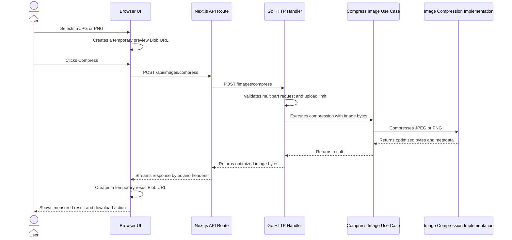

# Architecture

This document describes the current architecture, trade-offs, and expected evolution of the Go Image Optimizer.

The project is intentionally incremental. New components and patterns are introduced only when a concrete requirement or observed limitation justifies the complexity.

## 1. Context

Go Image Optimizer is an image optimization application with a backend written in Go and a web interface built with Next.js, React, and Tailwind CSS.

The current implementation provides the first usable compression flow for:

- JPEG / JPG
- PNG

WebP, AVIF, resizing, thumbnails, format conversion, processing history, and asynchronous processing are not part of the current implementation.

## 2. Current Request Flow



The browser keeps the selected image preview and compressed result only in React state and Blob URLs. These URLs are revoked when they are replaced, reset, or unmounted. A page reload intentionally clears the current optimization session.

## 3. Backend Boundaries

The backend now has a small but real application boundary:

```text
HTTP Handler
    -> Compress Image Use Case
        -> Image Compression implementation
```

Current responsibilities:

- HTTP handler: multipart parsing, the 25 MiB request limit, field validation, status codes, response headers, and download filename generation.
- Compress Image use case: application-level execution and context checks, independent of HTTP and multipart types.
- Image compression implementation: content sniffing, image validation, dimension safety checks, decoding, format-specific encoding, and compression settings.

The code does not introduce a domain model yet because the current feature does not have meaningful domain entities. The compressor interface exists as a useful boundary between the use case and the infrastructure implementation.

## 4. Compression Behavior

JPEG images are decoded and re-encoded as JPEG with a conservative quality value of `82`. This is intentionally lossy: it aims to reduce file size while keeping visible quality degradation low for many common images. The value is named in code so it can be revisited later with measurements and product requirements.

PNG images are decoded and re-encoded as PNG using Go's best PNG compression level. This is lossless for pixel content and preserves image dimensions. The amount of PNG reduction depends heavily on how the original PNG was encoded.

The application preserves the original image dimensions and response format for supported images. It does not promise every output will be smaller; already-optimized images may produce little or no reduction.

## 5. File Lifecycle and Storage

The current backend request lifecycle is ephemeral:

```text
Browser
    -> POST image
    -> Go receives bytes
    -> Go compresses bytes in memory
    -> Go returns optimized bytes
    -> Browser keeps result temporarily
    -> User downloads result
```

Uploaded images and compressed images are not persisted to application storage. The backend does not create processing IDs, database records, Redis records, object storage records, result URLs, or processing history.

Multipart temporary files, if the standard library creates any during request parsing, are cleaned with `MultipartForm.RemoveAll()` before the request finishes.

This is a current MVP design decision, not a permanent rejection of storage. Future versions may introduce temporary or persistent storage if asynchronous processing, resumable retrieval, higher throughput, or processing history justify it.

## 6. Synchronous Processing

Compression runs synchronously inside the Go HTTP request today because the MVP only needs immediate upload, processing, and download.

The application does not claim high-throughput or scalability characteristics. Those would need measurement under realistic workloads before being documented.

Current lightweight resource protections:

- Request body size is limited to 25 MiB.
- Multipart in-memory parsing is limited to 8 MiB before the standard library may spill to temporary files.
- Decoded image dimensions are limited to 32 megapixels to reduce obvious decompression-expansion risk.

## 7. Frontend Lifecycle

The frontend keeps the workflow in React state:

- initial drop zone;
- selected image preview and original file size;
- explicit Compress action;
- indeterminate loading state;
- optimized result preview, actual byte measurements, reduction calculation, and download action;
- reset path for another image.

The UI does not persist sessions in `localStorage`, IndexedDB, backend storage, or any other durable storage. After a reload, the selected image and result disappear by design.

## 8. Current Limitations

- Only JPEG/JPG and PNG are supported.
- JPEG compression is lossy.
- PNG compression is lossless for pixels, but reduction depends on the original encoding.
- Metadata preservation is not guaranteed.
- The backend returns the result synchronously and does not expose real progress events, so the frontend shows an indeterminate progress indicator.
- Some outputs may be the same size or larger than the uploaded file.
- There is no processing history, ID-based retrieval, background worker, queue, object storage, or TTL cleanup.

## 9. Possible Evolution

If future requirements need asynchronous processing, larger files, heavier formats, higher throughput, result sharing, or processing history, the architecture can evolve toward:

```text
Upload
    -> Processing ID
    -> Queue / worker
    -> Temporary or object storage
    -> Result retrieval
    -> TTL cleanup
```

That direction should be introduced only with clear requirements and documented trade-offs around storage, retention, cleanup, observability, security, and operational cost.
