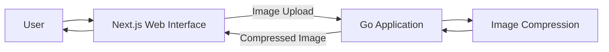
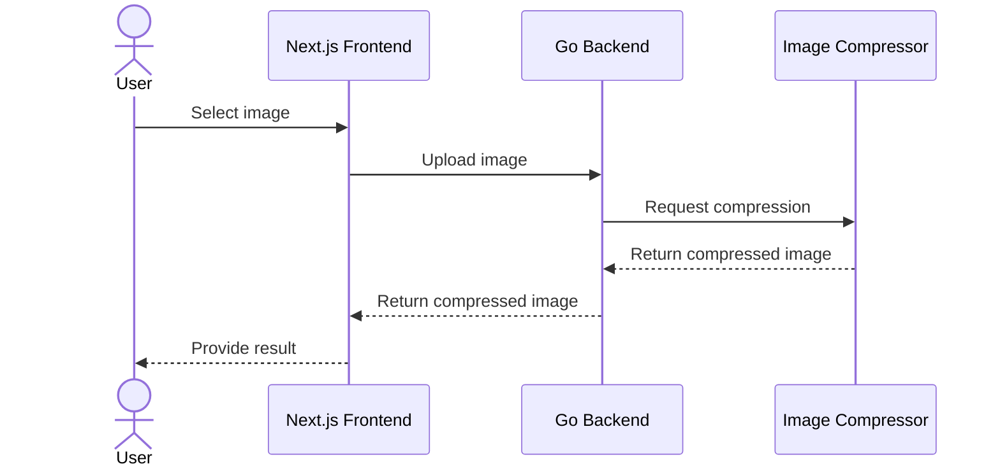

# Architecture

This document describes the architectural decisions, trade-offs, and evolution of the Go Image Optimizer.

The architecture is intentionally developed incrementally. New components and patterns should be introduced in response to concrete requirements, limitations, or technical problems rather than anticipated complexity.

## 1. Context

Go Image Optimizer is an image optimization application with a backend written in Go and a web interface built with Next.js, React, and Tailwind CSS.

The initial development scope focuses exclusively on image compression.

Additional optimization capabilities are planned, but they are not considered part of the current implementation until they are actually developed.

## 2. Current Requirements

The initial application should allow a user to:

1. Select an image through the web interface.
2. Upload the image to the Go backend.
3. Process the image using image compression.
4. Receive the compressed image as the result.

At this stage, the architecture should remain simple while providing a foundation that can evolve as new requirements emerge.

## 3. Initial Architecture

The initial architecture consists of a web frontend communicating with a Go backend responsible for image processing.

Image compression initially runs within the Go application.

This design avoids introducing additional services before there is a concrete requirement that justifies their operational and architectural complexity.

## 4. Architectural Decisions

The following decisions will be documented as the project evolves.

### ADR-001 — Go for the Backend

To be discussed and documented.

### ADR-002 — Next.js and React for the Web Interface

To be discussed and documented.

### ADR-003 — Tailwind CSS for Styling

To be discussed and documented.

### ADR-004 — Image Processing Inside the Go Application

To be discussed and documented.

## 5. Request Flow

For the initial image compression feature, the expected request flow is:

This flow represents the current architectural direction and may change as implementation decisions are made.

## 6. Current Limitations

The project is in its initial development stage.

Performance characteristics, concurrency limits, supported image formats, compression strategies, storage requirements, and scalability constraints have not yet been defined or validated.

These aspects will be documented based on actual implementation decisions and measurements rather than assumptions.

## 7. Architecture Evolution

The architecture is expected to evolve alongside the project.

Potential architectural changes will be evaluated when new requirements or observed limitations provide a concrete reason for introducing additional complexity.

Each significant architectural change should document:

- The problem being addressed.
- The available alternatives.
- The trade-offs considered.
- The chosen approach.
- The reasoning behind the decision.
- The consequences of the decision.
