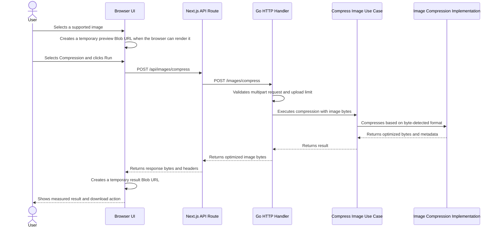

# Architecture

This document describes the current architecture, trade-offs, and expected evolution of the Go Image Optimizer.

The project is intentionally incremental. New components and patterns are introduced only when a concrete requirement or observed limitation justifies the complexity.

## 1. Context

Go Image Optimizer is an image optimization application with a backend written in Go and a web interface built with Next.js, React, and Tailwind CSS.

The current implementation provides synchronous Compression and Resize for these format families, subject to the feature-specific variant restrictions below:

- JPEG / JPG
- PNG
- WebP
- AVIF
- HEIC / HEIF
- GIF
- BMP
- TIFF

WebM, SVG, RAW camera formats, videos, archives, and arbitrary image formats are not supported.

## 2. Compression Request Flow



The browser keeps the selected image preview and compressed result only in React state and Blob URLs. These URLs are revoked when they are replaced, reset, or unmounted. A page reload intentionally clears the current optimization session.

Pipeline summary:

1. The browser sends a multipart upload to the Next.js API route.
2. The Next.js route forwards the form data to the Go backend.
3. The Go handler validates multipart shape and request size, then passes image bytes to the use case.
4. The compressor detects the real format from bytes before trusting any filename or MIME label.
5. The selected codec path validates decoded dimensions and, for animations, canvas-frame pixel limits.
6. The image is decoded, re-encoded in the same format family, and returned as bytes plus metadata.
7. The handler returns the compressed bytes with content type, content length, and download filename headers.
8. The browser stores the result temporarily in a Blob URL until replacement, reset, unmount, or reload.

## 3. Backend Boundaries

Compression uses this application boundary:

```text
HTTP Handler
    -> Compress Image Use Case
        -> Image Compression implementation
```

Current responsibilities:

- HTTP handler: multipart parsing, the 50 MiB request limit, field validation, status codes, response headers, and download filename generation.
- Compress Image use case: application-level execution and context checks, independent of HTTP and multipart types.
- Image compression implementation: byte-based format detection, image validation, dimension and animation safety checks, decoding, format-specific encoding, and compression settings.

The code does not introduce a domain model yet because the current features do not have meaningful domain entities. The compressor interface exists as a useful boundary between the use case and the infrastructure implementation.

This is best described as an intentionally small layered architecture with transport, application, and infrastructure concerns separated. It is not documented as "Clean Architecture": the project borrows a few useful boundary ideas, but it does not need entities, repositories, factories, or dependency injection frameworks for the current scope.

### Resize boundary and request trade-off

```text
ImageUploadForm → ImageResizeModal
  → Next.js image route → resize_image HTTP handler
    → application/imageresize UseCase
      → imaging/resize Decoder → request-local Source
        → target dimensions → resampling → source-family encoder
```

The resize application defines options, dimension rules, the decoder/source boundary, inspection, and execution. Imaging owns decoded pixels and codec details. Shared image format/result/error types live in `application/imageprocessing`; compression keeps aliases for compatibility. HEIF decode/encode and safe filename handling are shared where both features actually need them.

Inspection and processing are separate synchronous requests. The file is uploaded and decoded again for processing. This deliberately avoids introducing an ID, persistent upload cache, database, Redis, queue, worker, or object storage just to configure one image.

The application checks request context before/after decoding and processing and between animation frames. Individual codec calls are not forcibly interrupted by context cancellation. This is not background processing or a complete CPU/memory isolation mechanism.

## 4. Format Detection

The backend does not trust the filename extension or the browser-provided MIME type. It inspects the uploaded bytes and accepts only known signatures and container brands for the supported formats. Camera RAW signatures, including TIFF-based RAW containers such as DNG and CR2, are rejected instead of being routed through the TIFF compressor.

This is why a JPEG uploaded as `sample.png` is still processed as JPEG and returned with a JPEG download extension. A file named `broken.webp` with non-WebP bytes is rejected instead of being routed to the WebP codec.

## 5. Compression Behavior

The application preserves the source format family for supported images. It does not perform user-visible conversion between unrelated formats.

Current codec behavior:

- JPEG is decoded, EXIF orientation is applied to pixels, and the image is re-encoded as JPEG at quality `82`.
- PNG is decoded and re-encoded as PNG with the standard library's best compression. Pixel content and alpha are lossless.
- Static WebP is decoded and re-encoded as WebP. Lossless WebP input remains lossless; alpha is preserved.
- Animated WebP is decoded through the WebP animation container, reconstructed to full canvas frames, and re-encoded as animated WebP. Frame count, duration, loop count, background, and supported metadata chunks are preserved, but internal sub-frame rectangles and disposal choices may be normalized by the encoder.
- AVIF is decoded and re-encoded as AVIF. Decode auto-rotation is enabled. The implementation routes through `DecodeAll`/`EncodeAll`, but current automated coverage is for static AVIF fixtures.
- HEIC/HEIF uses native libheif and HEVC support. The backend accepts a single primary top-level image and rejects unsupported multi-image variants with `422`.
- GIF is decoded with Go's standard library and re-encoded as GIF. Animated GIF frames, delays, disposal, and loop settings are preserved by `gif.EncodeAll`.
- BMP is decoded and re-encoded as BMP. BMP output may not be smaller.
- TIFF is decoded and re-encoded as TIFF with Deflate compression and predictor enabled.

Already-optimized files can stay the same size or become larger. The frontend reports actual byte sizes rather than assuming a reduction.

## Image Resize

### User flow

Choose one image, select **Resize**, then click **Run**. A configuration modal opens without changing the Home layout. It reads dimensions from the backend, displays the original preview (or the existing browser fallback), and shows the proposed output dimensions.

- **Pixels** starts at the original, display-oriented dimensions. **Keep aspect ratio** is enabled initially. Editing either dimension anchors the ratio to that dimension. Unlocking the ratio permits stretching; there is no crop or padding.
- **Percentage** offers **25% smaller**, **50% smaller**, and **75% smaller**, with 50% selected initially. These percentages reduce each linear dimension, not file bytes or total pixel area.
- Dimensions are rounded to the nearest integer, with a minimum of one pixel. A 899 × 1599 image reduced by 50% becomes 450 × 800.
- Pixels allows enlargement within the resource limits. The summary shows the effective output dimensions, and a short note explains that enlargement does not add detail.
- **Resize image** submits the operation; **Cancel**, the close button, or Escape dismisses configuration while idle. Backdrop clicks do not dismiss it. During processing, settings and dismissal are disabled; loading is indeterminate.
- The result modal shows measured original/output dimensions and file sizes, preview/fallback, and download. It replaces the configuration modal. Its existing explicit-close behavior remains unchanged.
- The selected original stays available for another resize or compression. Configuration reopens at the original defaults. Failed processing keeps the options and shows an inline error; failed inspection has a retry action.

The configuration uses a native modal dialog for focus containment and background inertness, initial heading focus, keyboard-operable tabs, body scroll locking, and focus restoration. On narrow screens it becomes a vertically scrolling single-column dialog with a fixed footer inside the dialog.

### API

Both routes accept `multipart/form-data` with exactly one file field named `image`. Format and dimensions are determined from actual bytes; browser MIME, extension, and client dimension hints are not authoritative.

#### POST /images/resize/info

Returns JSON, for example:

```json
{"width":899,"height":1599,"format":"jpeg","contentType":"image/jpeg","frameCount":1}
```

The inspection path validates and decodes the source, without re-encoding or storing it. JPEG EXIF orientation and supported native orientation are reflected in the returned dimensions. This works even when the browser cannot preview the format. Inspection can be relatively expensive for large/native images; the modal shows a loading state. Closing the modal aborts the browser request.

#### POST /images/resize

| Field | Contract |
| --- | --- |
| `mode` | Required: `pixels` or `percentage` |
| `width`, `height` | Required in pixels mode: positive integers, each at most 32,000,000; the effective output must also satisfy total pixel limits |
| `axis` | `width` (default) or `height`; last edited dimension used to calculate the locked ratio |
| `keepAspectRatio` | `true` (default) or `false`; applies in pixels mode |
| `reduction` | Required in percentage mode: `25`, `50`, or `75` |

Booleans use literal `true`/`false`; explicitly empty values are rejected. Defaults apply when omitted. Duplicate option fields, extra files, and mixed file/text `image` fields are rejected. The UI serializes valid number inputs as decimal integers (including values entered using exponent notation). Percentage mode ignores width/height and always preserves proportions. The server recalculates targets from the uploaded source; a client cannot override the source dimensions. Resizing is always from the original input, not a previous result.

Success returns image bytes with:

- `Content-Type`, `Content-Length`, and an attachment `Content-Disposition` using a sanitized `*_resized` name and a source-family extension;
- `X-Original-Width`, `X-Original-Height`, `X-Image-Width`, `X-Image-Height` (display-oriented pixels);
- `Cache-Control: no-store`.

Errors use JSON `{ "error": "..." }`: 400 for malformed input/options, 413 for request/pixel/frame budgets, 415 for unsupported formats, 422 for unsupported variants, and 500 for codec/internal failures. The Next.js proxy returns 502 when the backend cannot be reached.

Same-origin Next.js routes are `/api/images/resize/info` and `/api/images/resize`. They forward the multipart body, response status/type, filename, and dimension headers through a shared image-request helper also used by compression.

### Image behavior and limits

- JPEG, PNG, WebP, static AVIF, supported single-image HEIC/HEIF, GIF, BMP, and single-page TIFF retain their format family. Existing compression support remains unchanged.
- Resize normalizes JPEG EXIF orientation before computing targets. Native AVIF/HEIF orientation follows the installed codec behavior.
- Catmull–Rom resampling works in premultiplied RGBA. PNG/WebP alpha is preserved; resampling changes pixels and is not a pixel-identical operation. BMP has the limitations of its encoder.
- GIF partial frames are composited using source disposal before resampling, then encoded as full-canvas frames with a web-safe palette, binary transparency, original delays, and original loop count. Palette/color quantization and internal disposal representation can change.
- Animated WebP preserves reconstructed full frames, timing, loop count, background, and ICC when present. EXIF/XMP are not copied by the Resize path, to avoid retaining stale dimensions/orientation. Metadata preservation is not universal.
- **Animated AVIF is rejected.** The installed `gen2brain/avif` v0.6.0 decoder returns frames and delays but does not populate `LoopCount`, so finite-loop preservation cannot be promised. APNG, multi-page TIFF, and unsupported multi-image HEIF are also rejected rather than flattened.
- The shared resource limits below apply to both inspection and processing. Resize also caps output at **32 million pixels** and animated output at **64 million canvas-frame pixels**. GIF descriptors and WebP container frame counts are checked before full frame decoding.
- If effective dimensions equal the original display dimensions, the original encoded bytes are returned unchanged, retaining their metadata and avoiding unnecessary lossy encoding.
- Otherwise, current encoder settings match the existing compression defaults (JPEG/WebP 82, AVIF/HEIF 60; PNG best compression; TIFF Deflate). A resized output may be larger in bytes. There is no batch, crop, format conversion, history, progress percentage, or promise of detail enhancement.

See [Test documentation](../../TESTS_README.md) for automated coverage and UI validation.

## 6. File Lifecycle and Storage

The backend request lifecycle is ephemeral:

```text
Browser
    -> POST image
    -> Go receives bytes
    -> Go compresses or resizes bytes
    -> Go returns optimized bytes
    -> Browser keeps result temporarily
    -> User downloads result
```

Uploaded images and processed images are not persisted to application storage. The backend does not create processing IDs, database records, Redis records, object storage records, result URLs, queues, background jobs, processing history, or TTL cleanup.

`storage/testdata/images` is a versioned test fixture directory. It contains real input files for integration tests and is not used by the running application for uploads or results. Tests read those fixtures and keep compressed outputs in memory or temporary OS paths.

Multipart temporary files, if the standard library creates any during request parsing, are cleaned with `MultipartForm.RemoveAll()` before the request finishes.

HEIC/HEIF encoding currently uses the libheif Go binding's file-output API internally. The compressor writes to an operating-system temporary file, reads the result back into memory, and removes that temporary file before returning the response. This does not create durable application storage.

## 7. Synchronous Processing

Compression and Resize run synchronously inside the Go HTTP request today because the application returns an immediate download response.

The application does not claim high-throughput or scalability characteristics. Those would need measurement under realistic workloads before being documented.

Current resource protections:

- Request body size is limited to 50 MiB.
- Multipart in-memory parsing is limited to 8 MiB before the standard library may spill to temporary files.
- Decoded image dimensions are limited to 32 megapixels.
- Animated GIF, animated WebP, and multi-frame AVIF are limited by `width * height * frame count`, with a default cap of 64 million canvas-frame pixels.

## 8. Frontend Lifecycle

The frontend is a Next.js application. `app/page.tsx` stays as the Home page composition layer and delegates Home-specific sections to `app/components/home/*`. `ImageUploadForm` owns client-side selection/submission/result state in `app/components/image-upload/`, while feature-local children handle the drop zone, operation controls, result modal, browser preview, result metrics, icons, types, and image/file helper logic. The Next.js routes under `app/api/images/` forward multipart requests to the Go backend while preserving relevant response headers.

The frontend keeps the workflow in React state:

- initial drop zone;
- selected image preview when the browser can render the format;
- non-preview placeholder for browser-unsupported formats such as many HEIC or TIFF files;
- original file size;
- operation selection and explicit Run action;
- Resize configuration with source inspection and effective output dimensions;
- indeterminate loading state;
- optimized result preview when the browser can render it;
- actual byte measurements, reduction calculation, and download action;
- reset path for another image.

The UI does not persist sessions in `localStorage`, IndexedDB, backend storage, or any other durable storage. After a reload, the selected image and result disappear by design.

## 9. Frontend and Backend Container Boundary

The separate frontend and backend containers are intentional. The frontend needs a Node/Next.js build and runtime; the backend needs a Go build, CGO, and native libheif runtime packages for HEIC/HEIF. Merging those containers would make the runtime image larger without simplifying the current architecture.

The `backend-test` Compose service is a local test/development convenience, not a production service. It uses the backend build stage so the Go toolchain and native headers are available for tests while the production `backend` service remains minimal.

## 10. Native Codec Decision

HEIC/HEIF support requires native libheif and HEVC codec plugins in Docker. The backend image therefore uses a CGO-enabled Alpine build and an Alpine runtime with libheif packages instead of a fully static distroless image.

See [ADR 001: Native Image Codecs](adr-001-native-image-codecs.md) and [Docker](docker.md).

## 11. Current Limitations

- Compression and Resize are synchronous.
- Metadata preservation is best-effort and format-specific, not a universal guarantee.
- Unsupported variants are rejected rather than approximated.
- Some outputs may be the same size or larger than the uploaded file.
- Browser preview support varies by format.
- There is no processing history, ID-based retrieval, background worker, queue, database, object storage, or TTL cleanup.

## 12. Possible Evolution

FUTURE / CONSIDERED: if future requirements need asynchronous processing, larger files, heavier formats, measured higher throughput, result sharing, or processing history, the architecture can evolve toward:

```text
Upload
    -> Processing ID
    -> Queue / worker
    -> Temporary or object storage
    -> Result retrieval
    -> TTL cleanup
```

That direction is not implemented today. It should be introduced only with clear requirements and documented trade-offs around storage, retention, cleanup, observability, security, and operational cost.
