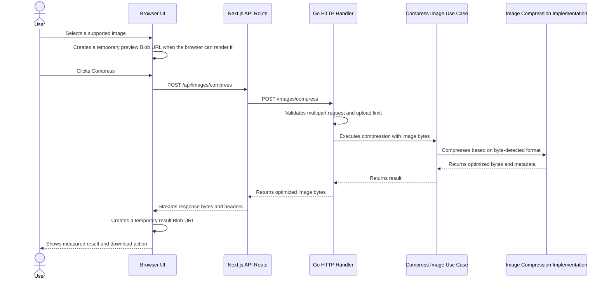

# Architecture

This document describes the current architecture, trade-offs, and expected evolution of the Go Image Optimizer.

The project is intentionally incremental. New components and patterns are introduced only when a concrete requirement or observed limitation justifies the complexity.

## 1. Context

Go Image Optimizer is an image optimization application with a backend written in Go and a web interface built with Next.js, React, and Tailwind CSS.

The current implementation provides a synchronous compression flow for exactly these image formats:

- JPEG / JPG
- PNG
- WebP
- AVIF
- HEIC / HEIF
- GIF
- BMP
- TIFF

WebM, SVG, RAW camera formats, videos, archives, and arbitrary image formats are not supported.

## 2. Current Request Flow



The browser keeps the selected image preview and compressed result only in React state and Blob URLs. These URLs are revoked when they are replaced, reset, or unmounted. A page reload intentionally clears the current optimization session.

Pipeline summary:

1. The browser sends a multipart upload to the Next.js API route.
2. The Next.js route forwards the form data to the Go backend.
3. The Go handler validates multipart shape and request size, then passes image bytes to the use case.
4. The compressor detects the real format from bytes before trusting any filename or MIME label.
5. The selected codec path validates decoded dimensions and, for animations, canvas-frame pixel limits.
6. The image is decoded, re-encoded in the same format family, and returned as bytes plus metadata.
7. The handler returns the compressed bytes with content type, content length, and download filename headers.
8. The browser stores the result temporarily in a Blob URL until replacement, reset, unmount, or reload.

## 3. Backend Boundaries

The backend has a small application boundary:

```text
HTTP Handler
    -> Compress Image Use Case
        -> Image Compression implementation
```

Current responsibilities:

- HTTP handler: multipart parsing, the 50 MiB request limit, field validation, status codes, response headers, and download filename generation.
- Compress Image use case: application-level execution and context checks, independent of HTTP and multipart types.
- Image compression implementation: byte-based format detection, image validation, dimension and animation safety checks, decoding, format-specific encoding, and compression settings.

The code does not introduce a domain model yet because the current feature does not have meaningful domain entities. The compressor interface exists as a useful boundary between the use case and the infrastructure implementation.

This is best described as an intentionally small layered architecture with transport, application, and infrastructure concerns separated. It is not documented as "Clean Architecture": the project borrows a few useful boundary ideas, but it does not need entities, repositories, factories, or dependency injection frameworks for the current phase.

Current review conclusion:

- IMPLEMENTED: dependency direction is simple and healthy for the current scope.
- DECIDED: codec-specific details belong in `internal/infrastructure/imaging`.
- DECIDED: HTTP parsing, status mapping, and download headers belong in `internal/infrastructure/http`.
- FUTURE: split the use case or add domain types only when new behavior creates real business rules beyond "compress this image".

## 4. Format Detection

The backend does not trust the filename extension or the browser-provided MIME type. It inspects the uploaded bytes and accepts only known signatures and container brands for the supported formats. Camera RAW signatures, including TIFF-based RAW containers such as DNG and CR2, are rejected instead of being routed through the TIFF compressor.

This is why a JPEG uploaded as `sample.png` is still processed as JPEG and returned with a JPEG download extension. A file named `broken.webp` with non-WebP bytes is rejected instead of being routed to the WebP codec.

## 5. Compression Behavior

The application preserves the source format family for supported images. It does not perform user-visible conversion between unrelated formats.

Current codec behavior:

- JPEG is decoded, EXIF orientation is applied to pixels, and the image is re-encoded as JPEG at quality `82`.
- PNG is decoded and re-encoded as PNG with the standard library's best compression. Pixel content and alpha are lossless.
- Static WebP is decoded and re-encoded as WebP. Lossless WebP input remains lossless; alpha is preserved.
- Animated WebP is decoded through the WebP animation container, reconstructed to full canvas frames, and re-encoded as animated WebP. Frame count, duration, loop count, background, and supported metadata chunks are preserved, but internal sub-frame rectangles and disposal choices may be normalized by the encoder.
- AVIF is decoded and re-encoded as AVIF. Decode auto-rotation is enabled. The implementation routes through `DecodeAll`/`EncodeAll`, but current automated coverage is for static AVIF fixtures.
- HEIC/HEIF uses native libheif and HEVC support. The backend accepts a single primary top-level image and rejects unsupported multi-image variants with `422`.
- GIF is decoded with Go's standard library and re-encoded as GIF. Animated GIF frames, delays, disposal, and loop settings are preserved by `gif.EncodeAll`.
- BMP is decoded and re-encoded as BMP. BMP output may not be smaller.
- TIFF is decoded and re-encoded as TIFF with Deflate compression and predictor enabled.

Already-optimized files can stay the same size or become larger. The frontend reports actual byte sizes rather than assuming a reduction.

## 6. File Lifecycle and Storage

The current backend request lifecycle is ephemeral:

```text
Browser
    -> POST image
    -> Go receives bytes
    -> Go compresses bytes
    -> Go returns optimized bytes
    -> Browser keeps result temporarily
    -> User downloads result
```

Uploaded images and compressed images are not persisted to application storage. The backend does not create processing IDs, database records, Redis records, object storage records, result URLs, queues, background jobs, processing history, or TTL cleanup.

`storage/testdata/images` is a versioned test fixture directory. It contains real input files for integration tests and is not used by the running application for uploads or results. Tests read those fixtures and keep compressed outputs in memory or temporary OS paths.

Multipart temporary files, if the standard library creates any during request parsing, are cleaned with `MultipartForm.RemoveAll()` before the request finishes.

HEIC/HEIF encoding currently uses the libheif Go binding's file-output API internally. The compressor writes to an operating-system temporary file, reads the result back into memory, and removes that temporary file before returning the response. This does not create durable application storage.

## 7. Synchronous Processing

Compression runs synchronously inside the Go HTTP request today because the application returns an immediate download response.

The application does not claim high-throughput or scalability characteristics. Those would need measurement under realistic workloads before being documented.

Current resource protections:

- Request body size is limited to 50 MiB.
- Multipart in-memory parsing is limited to 8 MiB before the standard library may spill to temporary files.
- Decoded image dimensions are limited to 32 megapixels.
- Animated GIF, animated WebP, and multi-frame AVIF are limited by `width * height * frame count`, with a default cap of 64 million canvas-frame pixels.

## 8. Frontend Lifecycle

The frontend is a Next.js application. The page composes the upload experience, `ImageUploadForm` owns client-side selection/submission/result state, and the Next.js route `app/api/images/compress/route.ts` forwards multipart requests to the Go backend while preserving relevant response headers.

The frontend keeps the workflow in React state:

- initial drop zone;
- selected image preview when the browser can render the format;
- non-preview placeholder for browser-unsupported formats such as many HEIC or TIFF files;
- original file size;
- explicit Compress action;
- indeterminate loading state;
- optimized result preview when the browser can render it;
- actual byte measurements, reduction calculation, and download action;
- reset path for another image.

The UI does not persist sessions in `localStorage`, IndexedDB, backend storage, or any other durable storage. After a reload, the selected image and result disappear by design.

Current frontend review conclusion:

- IMPLEMENTED: the browser UI, API forwarding route, and backend API are separated clearly enough for the current feature.
- VALID BUT WATCH: `ImageUploadForm` is large because it contains upload validation, preview fallback, modal behavior, and formatting helpers. This is acceptable for phase one, but extraction into smaller components or a request helper would become useful if more image actions are added.
- DECIDED: do not add a frontend test framework during this backend-focused phase.

## 9. Frontend and Backend Container Boundary

The separate frontend and backend containers are intentional. The frontend needs a Node/Next.js build and runtime; the backend needs a Go build, CGO, and native libheif runtime packages for HEIC/HEIF. Merging those containers would make the runtime image larger without simplifying the current architecture.

The `backend-test` Compose service is a local test/development convenience, not a production service. It uses the backend build stage so the Go toolchain and native headers are available for tests while the production `backend` service remains minimal.

## 10. Native Codec Decision

HEIC/HEIF support requires native libheif and HEVC codec plugins in Docker. The backend image therefore uses a CGO-enabled Alpine build and an Alpine runtime with libheif packages instead of a fully static distroless image.

See [ADR 001: Native Image Codecs](adr-001-native-image-codecs.md) and [Docker](docker.md).

## 11. Current Limitations

- Compression is synchronous.
- Metadata preservation is best-effort and format-specific, not a universal guarantee.
- Unsupported variants are rejected rather than approximated.
- Some outputs may be the same size or larger than the uploaded file.
- Browser preview support varies by format.
- There is no processing history, ID-based retrieval, background worker, queue, database, object storage, or TTL cleanup.

## 12. Possible Evolution

FUTURE / CONSIDERED: if future requirements need asynchronous processing, larger files, heavier formats, measured higher throughput, result sharing, or processing history, the architecture can evolve toward:

```text
Upload
    -> Processing ID
    -> Queue / worker
    -> Temporary or object storage
    -> Result retrieval
    -> TTL cleanup
```

That direction is not implemented today. It should be introduced only with clear requirements and documented trade-offs around storage, retention, cleanup, observability, security, and operational cost.
