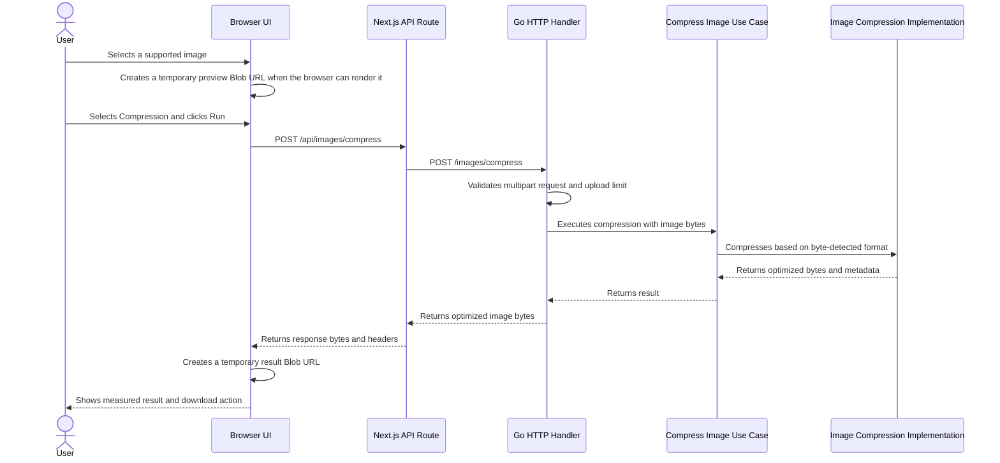

# Architecture

[English](architecture.md) | [Português](../pt-BR/architecture.md)

This document describes the current architecture, trade-offs, and completed functional scope of the Go Image Optimizer.

The current functional scope is complete. The architecture stays focused; maintenance and bug fixes remain possible, with no additional features planned.

## 1. Context

Go Image Optimizer is an image optimization application with a backend written in Go and a web interface built with Next.js, React, and Tailwind CSS.

The current implementation provides synchronous Compression, Resize and format conversion, plus browser-compatible preview fallback for these format families, subject to the feature-specific variant restrictions below:

- JPEG / JPG
- PNG
- WebP
- AVIF
- HEIC / HEIF
- GIF
- BMP
- TIFF

WebM, SVG, RAW camera formats, videos, archives, and arbitrary image formats are not supported.

## 2. Compression Request Flow


```mermaid
sequenceDiagram
    actor User
    participant Browser as Browser UI
    participant NextAPI as Next.js API Route
    participant Handler as Go HTTP Handler
    participant UseCase as Compress Image Use Case
    participant Compressor as Image Compression Implementation

    User->>Browser: Selects a supported image
    Browser->>Browser: Creates a temporary preview Blob URL when the browser can render it
    User->>Browser: Selects Compression and clicks Run
    Browser->>NextAPI: POST /api/images/compress
    NextAPI->>Handler: POST /images/compress
    Handler->>Handler: Validates multipart request and upload limit
    Handler->>UseCase: Executes compression with image bytes
    UseCase->>Compressor: Compresses based on byte-detected format
    Compressor-->>UseCase: Returns optimized bytes and metadata
    UseCase-->>Handler: Returns result
    Handler-->>NextAPI: Returns optimized image bytes
    NextAPI-->>Browser: Returns response bytes and headers
    Browser->>Browser: Creates a temporary result Blob URL
    Browser-->>User: Shows measured result and download action
```

The browser keeps the selected image preview and compressed result only in React state and Blob URLs. These URLs are revoked when they are replaced, reset, or unmounted. A page reload intentionally clears the current optimization session.

Pipeline summary:

1. The browser sends a multipart upload to the Next.js API route.
2. The Next.js route forwards the form data to the Go backend.
3. The Go handler validates multipart shape and request size, then passes image bytes to the use case.
4. The compressor detects the real format from bytes before trusting any filename or MIME label.
5. The selected codec path validates decoded dimensions and, for animations, canvas-frame pixel limits.
6. The image is decoded, re-encoded in the same format family, and returned as bytes plus metadata.
7. The handler returns the compressed bytes with content type, content length, and download filename headers.
8. The browser stores the result temporarily in a Blob URL until replacement, reset, unmount, or reload.

## 3. Backend Boundaries

Compression uses this application boundary:

```text
HTTP Handler
    -> Compress Image Use Case
        -> Image Compression implementation
```

Current responsibilities:

- HTTP handler: multipart parsing, the 50 MiB request limit, field validation, status codes, response headers, and download filename generation.
- Compress Image use case: application-level execution and context checks, independent of HTTP and multipart types.
- Image compression implementation: byte-based format detection, image validation, dimension and animation safety checks, decoding, format-specific encoding, and compression settings.

The code does not introduce a domain model yet because the current features do not have meaningful domain entities. The compressor interface exists as a useful boundary between the use case and the infrastructure implementation.

This is best described as an intentionally small layered architecture with transport, application, and infrastructure concerns separated. It is not documented as "Clean Architecture": the project borrows a few useful boundary ideas, but it does not need entities, repositories, factories, or dependency injection frameworks for the current scope.

### Resize boundary and request trade-off

```text
ImageUploadForm → ImageResizeModal
  → Next.js image route → resize_image HTTP handler
    → application/imageresize UseCase
      → imaging/resize Decoder → request-local Source
        → target dimensions → resampling → source-family encoder
```

The resize application defines options, dimension rules, the decoder/source boundary, inspection, and execution. Imaging owns decoded pixels and codec details. Shared image format/result/error types live in `application/imageprocessing`; compression keeps aliases for compatibility. HEIF decode/encode and safe filename handling are shared where both features actually need them.

Inspection and processing are separate synchronous requests. The file is uploaded and decoded again for processing. This deliberately avoids introducing an ID, persistent upload cache, database, Redis, queue, worker, or object storage just to configure one image.

The application checks request context before/after decoding and processing and between animation frames. Individual codec calls are not forcibly interrupted by context cancellation. This is not background processing or a complete CPU/memory isolation mechanism.

## 4. Format Detection

The backend does not trust the filename extension or the browser-provided MIME type. It inspects the uploaded bytes and accepts only known signatures and container brands for the supported formats. Camera RAW signatures, including TIFF-based RAW containers such as DNG and CR2, are rejected instead of being routed through the TIFF compressor.

This is why a JPEG uploaded as `sample.png` is still processed as JPEG and returned with a JPEG download extension. A file named `broken.webp` with non-WebP bytes is rejected instead of being routed to the WebP codec.

## 5. Compression Behavior

The compression operation preserves the source format family for supported images. Format conversion is a separate implemented operation.

Current codec behavior:

- JPEG is decoded, EXIF orientation is applied to pixels, and the image is re-encoded as JPEG at quality `82`.
- PNG is decoded and re-encoded as PNG with the standard library's best compression. Pixel content and alpha are lossless.
- Static WebP is decoded and re-encoded as WebP. Lossless WebP input remains lossless; alpha is preserved.
- Animated WebP is decoded through the WebP animation container, reconstructed to full canvas frames, and re-encoded as animated WebP. Frame count, duration, loop count, background, and supported metadata chunks are preserved, but internal sub-frame rectangles and disposal choices may be normalized by the encoder.
- AVIF is decoded and re-encoded as AVIF. Decode auto-rotation is enabled. The implementation routes through `DecodeAll`/`EncodeAll`, but current automated coverage is for static AVIF fixtures.
- HEIC/HEIF uses native libheif and HEVC support. The backend accepts a single primary top-level image and rejects unsupported multi-image variants with `422`.
- GIF is decoded with Go's standard library and re-encoded as GIF. Animated GIF frames, delays, disposal, and loop settings are preserved by `gif.EncodeAll`.
- BMP is decoded and re-encoded as BMP. BMP output may not be smaller.
- TIFF is decoded and re-encoded as TIFF with Deflate compression and predictor enabled.

Already-optimized files can stay the same size or become larger. The frontend reports actual byte sizes rather than assuming a reduction.

## Image Resize

### User flow

Choose one image, select **Resize**, then click **Run**. A configuration modal opens without changing the Home layout. It reads dimensions from the backend, displays the original preview (or the existing browser fallback), and shows the proposed output dimensions.

- **Pixels** starts at the original, display-oriented dimensions. **Keep aspect ratio** is enabled initially. Editing either dimension anchors the ratio to that dimension. Unlocking the ratio permits stretching; there is no crop or padding.
- **Percentage** offers **25% smaller**, **50% smaller**, and **75% smaller**, with 50% selected initially. These percentages reduce each linear dimension, not file bytes or total pixel area.
- Dimensions are rounded to the nearest integer, with a minimum of one pixel. A 899 × 1599 image reduced by 50% becomes 450 × 800.
- Pixels allows enlargement within the resource limits. The summary shows the effective output dimensions, and a short note explains that enlargement does not add detail.
- **Resize image** submits the operation; **Cancel**, the close button, or Escape dismisses configuration while idle. Backdrop clicks do not dismiss it. During processing, settings and dismissal are disabled; loading is indeterminate.
- The result modal shows measured original/output dimensions and file sizes, preview/fallback, and download. It replaces the configuration modal. Its existing explicit-close behavior remains unchanged.
- The selected original stays available for another resize or compression. Configuration reopens at the original defaults. Failed processing keeps the options and shows an inline error; failed inspection has a retry action.

The configuration uses a native modal dialog for focus containment and background inertness, initial heading focus, keyboard-operable tabs, body scroll locking, and focus restoration. On narrow screens it becomes a vertically scrolling single-column dialog with a fixed footer inside the dialog.

### API

Both routes accept `multipart/form-data` with exactly one file field named `image`. Format and dimensions are determined from actual bytes; browser MIME, extension, and client dimension hints are not authoritative.

#### POST /images/resize/info

Returns JSON, for example:

```json
{"width":899,"height":1599,"format":"jpeg","contentType":"image/jpeg","frameCount":1}
```

The inspection path validates and decodes the source, without re-encoding or storing it. JPEG EXIF orientation and supported native orientation are reflected in the returned dimensions. This works even when the browser cannot preview the format. Inspection can be relatively expensive for large/native images; the modal shows a loading state. Closing the modal aborts the browser request.

#### POST /images/resize

| Field | Contract |
| --- | --- |
| `mode` | Required: `pixels` or `percentage` |
| `width`, `height` | Required in pixels mode: positive integers, each at most 32,000,000; the effective output must also satisfy total pixel limits |
| `axis` | `width` (default) or `height`; last edited dimension used to calculate the locked ratio |
| `keepAspectRatio` | `true` (default) or `false`; applies in pixels mode |
| `reduction` | Required in percentage mode: `25`, `50`, or `75` |

`keepAspectRatio` accepts literal `true`/`false`; an explicitly empty value is rejected. An omitted or empty `axis` defaults to `width`; required numeric/mode fields still reject empty input. Other defaults apply as described above. Duplicate option fields, extra files, and mixed file/text `image` fields are rejected. The UI serializes valid number inputs as decimal integers (including values entered using exponent notation). Percentage mode ignores width/height and always preserves proportions. The server recalculates targets from the uploaded source; a client cannot override the source dimensions. Resizing is always from the original input, not a previous result.

Success returns image bytes with:

- `Content-Type`, `Content-Length`, and an attachment `Content-Disposition` using a sanitized `*_resized` name and a source-family extension;
- `X-Original-Width`, `X-Original-Height`, `X-Image-Width`, `X-Image-Height` (display-oriented pixels);
- `Cache-Control: no-store`.

Errors use JSON `{ "error": "..." }`: 400 for malformed input/options, 413 for request/pixel/frame budgets, 415 for unsupported formats, 422 for unsupported variants, and 500 for codec/internal failures. The Next.js proxy returns 502 when the backend cannot be reached.

Same-origin Next.js routes are `/api/images/resize/info` and `/api/images/resize`. They forward the multipart body, response status/type, filename, and dimension headers through a shared image-request helper also used by compression.

### Image behavior and limits

- JPEG, PNG, WebP, static AVIF, supported single-image HEIC/HEIF, GIF, BMP, and single-page TIFF retain their format family. Existing compression support remains unchanged.
- Resize normalizes JPEG EXIF orientation before computing targets. Native AVIF/HEIF orientation follows the installed codec behavior.
- Catmull–Rom resampling works in premultiplied RGBA. PNG/WebP alpha is preserved; resampling changes pixels and is not a pixel-identical operation. BMP has the limitations of its encoder.
- GIF partial frames are composited using source disposal before resampling, then encoded as full-canvas frames with a web-safe palette, binary transparency, original delays, and original loop count. Palette/color quantization and internal disposal representation can change.
- Animated WebP preserves reconstructed full frames, timing, loop count, background, and ICC when present. EXIF/XMP are not copied by the Resize path, to avoid retaining stale dimensions/orientation. Metadata preservation is not universal.
- **Animated AVIF is rejected.** The installed `gen2brain/avif` v0.6.0 decoder returns frames and delays but does not populate `LoopCount`, so finite-loop preservation cannot be promised. APNG, multi-page TIFF, and unsupported multi-image HEIF are also rejected rather than flattened.
- The shared resource limits below apply to both inspection and processing. Resize also caps output at **32 million pixels** and animated output at **64 million canvas-frame pixels**. GIF descriptors and WebP container frame counts are checked before full frame decoding.
- If effective dimensions equal the original display dimensions, the original encoded bytes are returned unchanged, retaining their metadata and avoiding unnecessary lossy encoding.
- Otherwise, current encoder settings match the existing compression defaults (JPEG/WebP 82, AVIF/HEIF 60; PNG best compression; TIFF Deflate). A resized output may be larger in bytes. Resize does not crop, convert formats, process batches or enhance detail. Conversion is a separate operation; history and percentage progress are outside the current scope.

See [Test documentation](testing.md) for automated coverage and UI validation.

## 6. File Lifecycle and Storage

The backend request lifecycle is ephemeral:

```text
Browser
    -> POST image
    -> Go receives bytes
    -> Go compresses, resizes or converts bytes
    -> Go returns optimized bytes
    -> Browser keeps result temporarily
    -> User downloads result
```

Uploaded images and processed images are not persisted to application storage. The backend does not create processing IDs, database records, Redis records, object storage records, result URLs, queues, background jobs, processing history, or TTL cleanup.

`storage/testdata/images` is a versioned test fixture directory. It contains real input files for integration tests and is not used by the running application for uploads or results. Tests read those fixtures and keep compressed outputs in memory or temporary OS paths.

Multipart temporary files, if the standard library creates any during request parsing, are cleaned with `MultipartForm.RemoveAll()` before the request finishes.

HEIC/HEIF encoding currently uses the libheif Go binding's file-output API internally. The compressor writes to an operating-system temporary file, reads the result back into memory, and removes that temporary file before returning the response. This does not create durable application storage.

## 7. Synchronous Processing

Compression, Resize, conversion and preview fallback run synchronously inside the Go HTTP request today because the application returns an immediate download response.

The application does not claim high-throughput or scalability characteristics. Those would need measurement under realistic workloads before being documented.

Current resource protections:

- Request body size is limited to 50 MiB.
- Multipart in-memory parsing is limited to 8 MiB before the standard library may spill to temporary files.
- Decoded image dimensions are limited to 32 megapixels.
- Animated GIF, animated WebP, and multi-frame AVIF are limited by `width * height * frame count`, with a default cap of 64 million canvas-frame pixels.

## 8. Frontend Lifecycle

The frontend is a Next.js application. `app/page.tsx` stays as the Home page composition layer and delegates Home-specific sections to `app/components/home/*`. `ImageUploadForm` owns client-side selection/submission/result state in `app/components/image-upload/`, while feature-local children handle the drop zone, operation controls, result modal, browser preview, result metrics, icons, types, and image/file helper logic. The Next.js routes under `app/api/images/` forward multipart requests to the Go backend while preserving relevant response headers.

The frontend keeps the workflow in React state:

- initial drop zone;
- selected image preview when the browser can render the format;
- backend thumbnail fallback when native image loading fails;
- original file size;
- operation selection and explicit Run action;
- Resize configuration with source inspection and effective output dimensions;
- indeterminate loading state;
- optimized result preview when the browser can render it;
- actual byte measurements, reduction calculation, and download action;
- reset path for another image.

The UI does not persist sessions in `localStorage`, IndexedDB, backend storage, or any other durable storage. After a reload, the selected image and result disappear by design.

## 9. Frontend and Backend Container Boundary

The separate frontend and backend containers are intentional. The frontend needs a Node/Next.js build and runtime; the backend needs a Go build, CGO, and native libheif runtime packages for HEIC/HEIF. Merging those containers would make the runtime image larger without simplifying the current architecture.

The `backend-test` Compose service is a local test/development convenience, not a production service. It uses the backend build stage so the Go toolchain and native headers are available for tests while the production `backend` service remains minimal.

## 10. Native Codec Decision

HEIC/HEIF support requires native libheif and HEVC codec plugins in Docker. The backend image therefore uses a CGO-enabled Alpine build and an Alpine runtime with libheif packages instead of a fully static distroless image.

See [ADR 001: Native Image Codecs](adr/001-native-image-codecs.md) and [Docker](docker.md).

## 11. Current Limitations

- Processing is synchronous; codec calls can outlive cancellation checkpoints.
- Metadata preservation is best-effort and format-specific, not a universal guarantee.
- Unsupported variants are rejected rather than approximated.
- Some outputs may be the same size or larger than the uploaded file.
- Browser preview support varies by format.
- No global concurrency admission control or measured production capacity is implemented.

History, ID-based retrieval, databases, Redis, queues, workers, persistent images/object storage, a separate thumbnail operation and image editing are deliberate scope exclusions, not scheduled next steps.

## Scope completion

The functional scope is complete for this portfolio project. No additional features are planned. Resize already creates smaller images; advanced thumbnail composition or image editing belongs to another scope. Maintenance and fixes remain possible. A future requirement for asynchronous workloads would first need evidence about latency, resource consumption and retention needs before any infrastructure decision.

## Format conversion

Select an image, choose **Convert format**, and click **Run** to configure conversion. Byte-based inspection reports the actual source family and oriented dimensions. **Convert image** preserves dimensions and leaves the original selected. Results show source/output formats, measured sizes, reduction, increase or no size change, a preview fallback, and a download of the converted bytes even when larger.

Verified outputs: JPEG (JPG), PNG, WebP, AVIF, HEIC/HEIF (HEVC), GIF, BMP and TIFF. Aliases are not separate algorithms. The source family is disabled and rejected server-side. All animated conversions are rejected; no animation pair is offered. APNG, AVIF sequences and multi-image TIFF/HEIF are also rejected by the shared inspection rules.

JPEG, BMP and HEIC composite transparency onto white. PNG, WebP, AVIF and TIFF preserve alpha; GIF uses the WebSafe palette and binary transparency (50% threshold), which can lose colors and partial alpha. Defaults: JPEG/WebP quality 82, WebP method 4/alpha 100, AVIF quality 60/alpha 100/speed 6, HEVC quality 60, PNG best compression, TIFF Deflate with predictor. Metadata and color profiles are not universally preserved. Orientation follows the shared decoder: normalized JPEG EXIF, AVIF autorotation and codec-applied HEIF transformations; other static formats apply EXIF orientation when recognized by the installed metadata reader. No new native codecs are introduced.

`POST /images/convert` (same-origin proxy `POST /api/images/convert`) accepts exactly one multipart file `image` and one `targetFormat`: `jpeg`, `png`, `webp`, `avif`, `heif`, `gif`, `bmp` or `tiff`. Extra fields, duplicates and same-family targets return 400. Unsupported variants return 422. `POST /images/convert/info` (proxy `/api/images/convert/info`) accepts only `image` and returns `width`, `height`, `format`, `contentType`, and `frameCount`.

Success returns encoded bytes, correct Content-Type/Length, sanitized Content-Disposition with `_converted` and destination extension, Cache-Control no-store, and X-Source-Format, X-Output-Format, X-Original-Width/Height and X-Image-Width/Height headers. Limits: 50 MiB request body, 32 million pixels, 64 million cumulative animation canvas pixels during inspection, and 50 MiB output. Output size is checked after encoding; encoder transient memory is codec-dependent. Processing remains synchronous and stateless, including cleanup of temporary HEIF files.

Conversion uses `imageconversion` to validate destinations and coordinate processing, `imaging/convert` to encode oriented pixels from the shared Resize decoder, and `handler/convert_image` for multipart transport and download. The Next.js proxy forwards source/output formats and dimensions. `ImageSettingsDialog` shares the modal shell, focus and close behavior between Resize and Convert; controls and state remain separate, while `ImageResultModal` presents both results.

## Image previews

Uploads, Resize/Convert settings and all result dialogs first try native browser image loading. Display-only MIME correction handles mislabeled JPEG, PNG, GIF, WebP and AVIF bytes without changing the source. If loading fails, the shared component posts the actual File or processed result Blob to the same-origin `/api/images/preview` proxy and Go `POST /images/preview` endpoint (exactly one multipart file named `image`).

The stateless endpoint reuses processing detection, decoding, orientation and resource/variant checks. It returns an aspect-ratio-preserving thumbnail bounded by 1200 × 1200, without cropping or enlargement: PNG for transparency, JPEG for opaque pixels, with the corresponding Content-Type and `Cache-Control: no-store`. Supported static JPEG, PNG, WebP, AVIF, HEIC/HEIF, GIF, BMP and single-page TIFF inputs can use the fallback. Animations, APNG, AVIF sequences, multipage TIFF and unsupported multi-image HEIF remain explicit unsupported previews; RAW remains unsupported. Native browser previews may still display variants that the fallback rejects.

Loading, errors and **Retry preview** remain within the preview area. Failures do not block operations or downloads. Generated bytes are cached by source Blob identity for the session, concurrent requests are shared, obsolete requests are aborted when their last consumer leaves, stale responses are ignored and display Object URLs are revoked. The cache keeps bytes, not long-lived Object URLs. Original upload bytes and actual processed results remain separate from display-only bytes; downloads, names, formats, sizes and reported dimensions describe the actual files, never the thumbnail. Reloading clears the cache.

Resize/conversion/preview check context at processing checkpoints; Compression only checks before/after its compressor call, whose interface has no context parameter. Resize accepts unknown text options and its inspection path does not reject all extra text fields; conversion inspection/preview reject extra text fields, and conversion processing permits only targetFormat. Do not infer identical strict multipart policies from shared error/filename helpers.

## Trade-offs

These are benefits and costs visible in the current code, not invented historical motivations.

| Decision | Benefit | Cost or limitation |
| --- | --- | --- |
| Synchronous HTTP processing | One request returns downloadable bytes; no job lifecycle | CPU-heavy codecs occupy the request; no measured concurrency capacity or admission control |
| Stateless requests and separate inspection | No server session ID, upload cache or retention policy | Resize uploads/decodes again after inspection; conversion Execute inspects then Processor.Convert decodes again |
| No persistent uploads/results or history | No image database, object storage, Redis, queue or worker to operate | Results are lost on reload; no later retrieval or sharing link |
| Reuse helpers where behavior overlaps | Detection, errors, HEIF, filenames and Resize decoding are shared | Compression has its own paths; animation, metadata and encoding policies still differ by operation |
| Existing codec libraries | Real decode/encode for eight families, including HEIF | Family detection is not support for every variant; library behavior and native ABI remain dependencies |
| CGO and native libheif | HEVC decode/encode is available in the container | Build needs C tools/headers; runtime needs libheif, libde265 and x265 plugins; output uses cleaned OS temporary files |
| Browser-native previews with fallback | Native display avoids a server round trip when possible; static HEIC/TIFF can get JPEG/PNG previews | Fallback requires upload/decode and rejects animations; display compatibility does not preserve source metadata |
| Fixed encoding defaults | Predictable processing without a quality settings UI | JPEG/WebP 82 and AVIF/HEVC 60 are lossy defaults, not a perceptual quality guarantee; repeated encoding can lose detail |
| Catmull–Rom in premultiplied RGBA | Smooth resampling and fewer dark fringes at alpha edges | More work than nearest-neighbor; interpolation changes pixels, may introduce ringing and cannot restore missing detail |
| Explicit transparency policies | Conversion composites JPEG/BMP/HEIF on white; alpha-capable destinations retain alpha | GIF uses a WebSafe palette and binary alpha at 50%; partial transparency/colors can be lost; Resize BMP follows encoder constraints |
| Orientation normalization without universal metadata copying | JPEG Resize uses EXIF orientation; conversion/preview additionally normalize recognized EXIF in other static families; AVIF/HEIF apply codec transforms | Re-encoding does not universally copy EXIF/XMP/ICC or guarantee color-profile fidelity; no-op Resize uniquely returns original bytes |
| Explicit variant restrictions | Resize preserves supported GIF/WebP frame timing/loops instead of flattening; conversion/preview reject animations | Resize rejects AVIF sequences because loop counts are not exposed, APNG, multipage TIFF and unsupported multi-image HEIF; Compression policies differ |
| Measured bytes instead of promised savings | Larger valid results remain downloadable and are reported honestly | Format changes, headers, palettes and codec settings can increase size even after dimension reduction |
| Resource checks and cooperative cancellation | 50 MiB body, 32 million pixels and 64 million canvas-frame pixels reject many oversized requests | Not a process memory ceiling; output cap of 50 MiB is conversion-specific and checked after encoding; native codec calls and Catmull–Rom scaling cannot be forcibly canceled |
| Focused functional scope | Go processing and Next.js interaction remain explainable and reviewable | Separate thumbnails, history, databases, queues, workers, persistent storage and image editing are deliberately excluded |

Server socket timeouts are 5 seconds for headers, 2 minutes for reads/writes and 60 seconds idle (`http/server.go`). They are not an operation deadline that kills native processing. The Next.js proxy buffers multipart and response bytes; its file-size check happens after parsing. Concurrent requests multiply decoded-frame memory, so passing bounded fixture tests does not establish safe production throughput.

PNG best compression and TIFF Deflate/predictor are lossless encodings of the supplied pixels. Static lossless WebP remains lossless during Compression/Resize, while conversion to WebP uses its lossy default. Resize changes pixels regardless of a lossless output codec. Compression's AVIF multi-frame path should not be described as verified universal animation support: automated AVIF fixtures are static, and Resize/conversion/preview apply stricter policies.

The two application containers separate Node and Go/native runtime dependencies. They do not establish a microservice system. Maintenance may address defects or library compatibility within the completed scope. Production evolution should start from a concrete requirement and measurements; it is not a new feature roadmap.

## Architecture Decisions & Trade-offs

### Status and interpretation

**Implemented:** Compression, Resize, format conversion and preview fallback, with request-scoped results and backend/frontend automated tests. **Designed / architecturally prepared:** small processor/decoder interfaces permit alternative implementations; they are not delivered worker services. **Planned / future work:** no additional product features are currently planned. Reconsideration conditions below are conditional engineering reviews, not commitments to add infrastructure.

The Technical Interview guide confirms Go as a deliberate learning project and the completed scope. The explanations below also use current source; alternatives describe reasonable options rather than undocumented historical deliberation. The preceding trade-off table remains the detailed behavior reference.

### Decision: Go packages and small interfaces for image processing

**Context and decision.** Decode, transform and encode are substantial work compared with routing an HTTP request. Go's `net/http`, explicit constructors, returned errors and small interfaces let the application coordinate that work without an HTTP framework or dependency-injection container. `NewRouter` wires concrete imaging implementations to application-owned Compressor, Decoder/Source and Processor contracts.

**Why and alternatives.** This fits the learning goal and makes pixel work independently testable from multipart HTTP. A Node-only app would reduce runtimes but move codec/native integration into another ecosystem; an external imaging service would add deployment and transport boundaries. There is no benchmark proving Go faster than those alternatives.

**Trade-offs and consequences.** Shared format/result/error types avoid drifting contracts across operations. Interfaces are placed where substitution is useful rather than adding repositories/entities to a product without persistence. Go handles concurrent requests, but an individual codec invocation is synchronous; no worker pool, per-image parallelization or global admission control is implemented. CPU-intensive encoding and decoded buffers can dominate processing; multipart/proxy/network and HEIF temporary files add I/O. Garbage collection does not impose a memory budget or manage every native allocation.

**Revisit when.** Profiling identifies a codec bottleneck, measured concurrency needs admission control, or native decoding requires process isolation.

**Evidence:** [router](../../backend/internal/infrastructure/http/router.go), [application contracts](../../backend/internal/application), [dependencies](../../backend/go.mod).

### Decision: React interaction behind a same-origin Next.js proxy

**Context and decision.** File selection, configuration dialogs, previews and downloads need browser state, while Go owns image validation and codecs. React components divide selection, settings and results; Next.js API routes forward multipart and useful output headers using a server-configured backend URL.

**Why and alternatives.** The browser can use relative URLs without knowing Docker service names or adding a cross-origin API arrangement. A static React app calling Go directly removes a server hop but needs API-origin/deployment configuration and CORS. Go-served HTML would reduce infrastructure with a different interactive UI implementation.

**Trade-offs and consequences.** Node and Go are two runtimes, not independently owned domain microservices. The proxy parses the complete form and buffers backend bytes via `arrayBuffer`; this is not end-to-end streaming and adds memory copies. Its file check occurs after parsing. A failed backend connection becomes 502. No progress endpoint exists: the UI uses indeterminate loading and disables relevant actions during processing. Original and result Blobs remain separate, enabling repeated operations on the original and truthful download metadata.

**Revisit when.** Large uploads or concurrent transfers make buffering costly, or another client needs a direct Go API contract.

**Evidence:** [proxy](../../frontend/app/api/images/forward-image-request.ts), [upload state](../../frontend/app/components/image-upload/image-upload-form.tsx), [settings shell](../../frontend/app/components/image-upload/image-settings-dialog.tsx).

### Decision: Synchronous, ephemeral results without server history

**Context and decision.** A user processes one selected file and downloads the response. The backend retains no uploaded/result record, database ID or object-store key. Browser Object URLs are revoked when replaced/unmounted. HEIF output uses an OS temporary file because the binding exposes a file writer; the helper closes, reads and removes it. Multipart parsing can spill to temporary files and handlers remove them.

**Why and alternatives.** One response avoids job IDs, polling, retention, access control on stored images and retry orchestration. Queued jobs would support processing beyond a request lifetime, but require durable job/file state. An upload cache would avoid repeated inspection uploads at the cost of retention/expiry complexity.

**Trade-offs and consequences.** Reload loses results; there is no later retrieval or sharing link. Inspection uploads/decodes again for processing, and conversion has another internal inspection/decode. Cancellation is cooperative: Compression checks only around the compressor; other operations have checkpoints, not forcibly interruptible native calls. HTTP socket timeouts are not CPU execution deadlines. Cleanup on normal returns/errors is explicit but cannot prove recovery after process crash or absence of native leaks.

**Revisit when.** A concrete product requirement needs long-running jobs, batch processing or retrieval after reload; measure duration/resources and specify retention/recovery before adopting a queue/store.

**Evidence:** [HEIF helper](../../backend/internal/infrastructure/imaging/heif.go), [server timeouts](../../backend/internal/infrastructure/http/server.go), [compression use case](../../backend/internal/application/imagecompression/usecase.go), [conversion use case](../../backend/internal/application/imageconversion/usecase.go).

### Decision: Validate actual bytes and bound work, without claiming sandboxing

**Context and decision.** Extension/MIME can lie, and a small compressed file can decode to many pixels. Byte signatures/container brands select codecs; decoders validate content and supported variants. Go limits request bodies to 50 MiB, decoded pixels to 32 million and animation canvas-frame work to 64 million where implemented. The 8 MiB multipart setting is a spill threshold, not the upload limit. Conversion alone caps encoded output at 50 MiB after encoding.

**Why and alternatives.** Server-owned validation avoids relying on UI hints. Client-only checks would be bypassable; subprocess isolation with memory/CPU controls would provide a stronger resource boundary with more deployment complexity.

**Trade-offs and consequences.** These limits reduce exposure but do not cap total process memory, native transient allocation or concurrent work. Panic recovery cannot recover every native crash or out-of-memory termination. Compression multipart checks are looser than conversion/preview, and resize accepts some extra text fields; shared helpers do not imply identical contracts. There is no authentication/rate limiter. Unlike Aurora/URL Shortener, Compose host ports are not restricted to loopback. Exposure and resource isolation need a separate deployment review.

**Revisit when.** Untrusted public traffic, concurrent large images or strict resource isolation becomes a requirement.

**Evidence:** [detection](../../backend/internal/infrastructure/imaging/detection.go), [limits](../../backend/internal/infrastructure/imaging/limits.go), [HTTP handlers](../../backend/internal/infrastructure/http/handler), [Compose](../../docker-compose.yml).

### Decision: Explicit format policies and real native HEIF support

**Context and decision.** Compression retains family/dimensions; Resize changes dimensions; conversion changes family. Codec defaults, orientation, alpha and variant restrictions define different outcomes, rather than promising every format behaves identically. Same-size Resize returns original bytes. Unsupported conversion/preview animations are rejected rather than silently flattened.

**Why and alternatives.** Fixed defaults keep the UI focused; a quality/metadata editor would widen scope. Reusing the Resize decoder and HEIF helpers keeps common behavior together, while operation-specific encoding remains separate. Native libheif/HEVC provides real HEIC support; dropping HEIF would allow a simpler native dependency chain. See [ADR 001](adr/001-native-image-codecs.md).

**Trade-offs and consequences.** CGO requires compiler/headers in build and libheif/plugins at runtime; the container cannot be assumed fully static. Lossy re-encoding can lose detail, and metadata/ICC are not universally copied. Catmull–Rom changes pixels and cannot create missing detail. Actual result bytes may increase; UI metrics report increase/no change as well as reduction. Containerized native tests plus independently decoded synthetic/real fixtures test format, dimensions, alpha, orientation and timing, not universal compatibility or visual quality. There is no checked-in browser interaction suite; frontend calculation/cache tests do not prove focus or cross-browser rendering.

**Revisit when.** Requirements change to color fidelity, broader variants, fully static deployment or different encoding controls. First define representative fixtures and quality/resource measurements.

**Evidence:** [native ADR](adr/001-native-image-codecs.md), [conversion encoder](../../backend/internal/infrastructure/imaging/convert/processor.go), [test guide](testing.md).

### Decision: Native browser previews before display-only backend fallback

**Context and decision.** Some browsers cannot show files the backend can process. Native loading avoids a request when it works; otherwise Go generates an aspect-preserving preview up to 1200 × 1200, PNG for alpha and JPEG for opaque pixels. A WeakMap keyed by Blob identity shares preview requests/bytes within the browser session; no server cache exists.

**Why and alternatives.** Display bytes are separate from source/download bytes, so fallback never silently replaces the actual output. Always converting previews server-side would duplicate work for browser-supported images. Browser-only preview would leave HEIF/TIFF users without useful feedback.

**Trade-offs and consequences.** Fallback costs upload/decode and supports static variants only. Retry stays inside the preview area; failure does not block processing/download. Last-consumer release aborts obsolete requests; components ignore stale responses and revoke display URLs. Identity caching does not deduplicate equal byte content in different Blobs and disappears on reload.

**Revisit when.** Preview traffic or browser memory is measurably problematic, or animated fallback becomes an explicit requirement.

**Evidence:** [cache](../../frontend/app/components/image-upload/preview-cache.ts), [preview component](../../frontend/app/components/image-upload/browser-image-preview.tsx), [preview processor](../../backend/internal/infrastructure/imaging/convert/preview.go).
