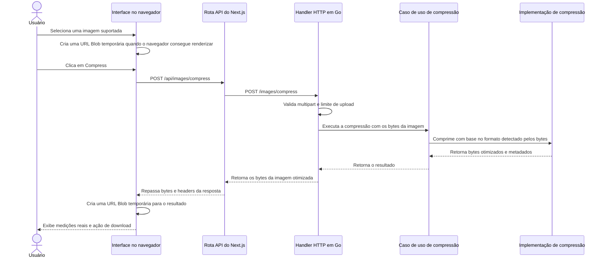

# Arquitetura

Este documento descreve a arquitetura atual, os trade-offs e a evolução esperada do Go Image Optimizer.

O projeto evolui de forma incremental. Novos componentes e padrões só devem ser introduzidos quando um requisito concreto ou uma limitação observada justificar essa complexidade.

## 1. Contexto

Go Image Optimizer é uma aplicação para otimização de imagens com backend em Go e interface web construída com Next.js, React e Tailwind CSS.

A implementação atual entrega um fluxo síncrono de compressão exatamente para estes formatos:

- JPEG / JPG
- PNG
- WebP
- AVIF
- HEIC / HEIF
- GIF
- BMP
- TIFF

WebM, SVG, formatos RAW de câmera, vídeos, arquivos compactados e formatos arbitrários de imagem não são suportados.

## 2. Fluxo atual da requisição



O navegador mantém o preview da imagem selecionada e o resultado comprimido apenas em estado React e URLs Blob. Essas URLs são revogadas quando são substituídas, quando o fluxo é reiniciado ou quando o componente é desmontado. Ao recarregar a página, a sessão atual desaparece de forma intencional.

Resumo do pipeline:

1. O navegador envia um upload multipart para a rota API do Next.js.
2. A rota do Next.js encaminha o form data para o backend Go.
3. O handler Go valida a estrutura multipart e o limite da requisição, depois passa os bytes da imagem para o caso de uso.
4. O compressor detecta o formato real pelos bytes antes de confiar em qualquer nome de arquivo ou MIME type.
5. O caminho de codec selecionado valida as dimensões decodificadas e, para animações, os limites de pixels de canvas-frame.
6. A imagem é decodificada, reencodada na mesma família de formato e retornada como bytes com metadados.
7. O handler devolve os bytes comprimidos com headers de content type, content length e nome de download.
8. O navegador mantém o resultado temporariamente em uma URL Blob até substituição, reset, desmontagem ou reload.

## 3. Fronteiras no backend

O backend possui uma fronteira pequena de aplicação:

```text
Handler HTTP
    -> Caso de uso de compressão de imagem
        -> Implementação de compressão de imagem
```

Responsabilidades atuais:

- Handler HTTP: leitura do multipart, limite de 50 MiB, validação dos campos, status codes, headers de resposta e geração do nome de download.
- Caso de uso de compressão: execução da regra de aplicação e checagens de contexto, sem depender de HTTP ou tipos de multipart.
- Implementação de compressão: identificação do conteúdo real pelos bytes, validação da imagem, proteção por dimensão e por animação, decode, encode específico por formato e configurações de compressão.

O projeto ainda não cria um modelo de domínio porque a funcionalidade atual não possui entidades de domínio relevantes. A interface do compressor existe como uma fronteira útil entre o caso de uso e a implementação de infraestrutura.

Essa estrutura é melhor descrita como uma arquitetura em camadas pequena e intencional, com separação entre transporte, aplicação e infraestrutura. Ela não é documentada como "Clean Architecture": o projeto aproveita algumas ideias úteis de fronteira, mas não precisa de entidades, repositories, factories ou frameworks de injeção de dependência na fase atual.

Conclusão da revisão atual:

- IMPLEMENTADO: a direção de dependências é simples e saudável para o escopo atual.
- DECIDIDO: detalhes específicos de codec pertencem a `internal/infrastructure/imaging`.
- DECIDIDO: parsing HTTP, mapeamento de status e headers de download pertencem a `internal/infrastructure/http`.
- FUTURO: dividir o caso de uso ou adicionar tipos de domínio somente quando novos comportamentos criarem regras reais além de "comprimir esta imagem".

## 4. Detecção de formato

O backend não confia na extensão do arquivo nem no MIME type informado pelo navegador. Ele inspeciona os bytes enviados e aceita apenas assinaturas e marcas de container conhecidas para os formatos suportados. Assinaturas de RAW de câmera, incluindo containers RAW baseados em TIFF como DNG e CR2, são rejeitadas em vez de serem direcionadas ao compressor TIFF.

Por isso, um JPEG enviado como `sample.png` ainda é processado como JPEG e retorna com extensão de download JPEG. Um arquivo chamado `broken.webp` com bytes que não são WebP é rejeitado em vez de ser encaminhado ao codec WebP.

## 5. Comportamento da compressão

A aplicação preserva a família do formato de origem para imagens suportadas. Ela não faz conversão visível entre formatos não relacionados.

Comportamento atual dos codecs:

- JPEG é decodificado, a orientação EXIF é aplicada aos pixels e a imagem é reencodada como JPEG com qualidade `82`.
- PNG é decodificado e reencodado como PNG com o melhor nível de compressão da biblioteca padrão. Pixels e alpha são lossless.
- WebP estático é decodificado e reencodado como WebP. Entrada WebP lossless continua lossless; alpha é preservado.
- WebP animado é decodificado pelo container de animação, reconstruído como frames de canvas completo e reencodado como WebP animado. Quantidade de frames, duração, loop, cor de fundo e chunks de metadados suportados são preservados, mas retângulos internos de sub-frame e escolhas de disposal podem ser normalizados pelo encoder.
- AVIF é decodificado e reencodado como AVIF. A rotação automática no decode fica habilitada. A implementação passa por `DecodeAll`/`EncodeAll`, mas a cobertura automatizada atual é para fixtures AVIF estáticas.
- HEIC/HEIF usa libheif e suporte HEVC nativos. O backend aceita uma imagem primária top-level e rejeita variantes multi-imagem não suportadas com `422`.
- GIF é decodificado com a biblioteca padrão do Go e reencodado como GIF. Frames, delays, disposal e loop de GIF animado são preservados por `gif.EncodeAll`.
- BMP é decodificado e reencodado como BMP. A saída BMP pode não ficar menor.
- TIFF é decodificado e reencodado como TIFF com compressão Deflate e predictor habilitado.

Arquivos já otimizados podem continuar com o mesmo tamanho ou ficar maiores. O frontend exibe medições reais de bytes em vez de presumir redução.

## 6. Ciclo de vida dos arquivos e armazenamento

O ciclo de vida atual no backend é efêmero:

```text
Navegador
    -> POST da imagem
    -> Go recebe os bytes
    -> Go comprime os bytes
    -> Go retorna os bytes otimizados
    -> Navegador mantém o resultado temporariamente
    -> Usuário baixa o resultado
```

Imagens enviadas e imagens comprimidas não são persistidas em armazenamento da aplicação. O backend não cria IDs de processamento, registros em banco de dados, registros no Redis, objetos em storage, URLs de resultado, filas, jobs em background, histórico de processamento ou limpeza por TTL.

`storage/testdata/images` é um diretório versionado de fixtures de teste. Ele contém arquivos reais de entrada para testes de integração e não é usado pela aplicação em execução para uploads ou resultados. Os testes leem essas fixtures e mantêm as saídas comprimidas em memória ou em caminhos temporários do sistema operacional.

Arquivos temporários de multipart, caso a biblioteca padrão crie algum durante o parsing da requisição, são removidos com `MultipartForm.RemoveAll()` antes do fim da requisição.

A codificação HEIC/HEIF usa internamente a API de saída para arquivo do binding Go da libheif. O compressor escreve em um arquivo temporário do sistema operacional, lê o resultado de volta para memória e remove esse arquivo temporário antes de devolver a resposta. Isso não cria armazenamento durável da aplicação.

## 7. Processamento síncrono

Hoje a compressão roda de forma síncrona dentro da requisição HTTP em Go porque a aplicação devolve um download imediato.

A aplicação não declara características de alta vazão ou escalabilidade. Qualquer afirmação desse tipo precisa ser medida em cargas realistas antes de entrar na documentação.

Proteções atuais de recursos:

- O corpo da requisição é limitado a 50 MiB.
- O parsing multipart mantém até 8 MiB em memória antes de a biblioteca padrão poder usar arquivos temporários.
- As dimensões decodificadas são limitadas a 32 megapixels.
- GIF animado, WebP animado e AVIF com múltiplos frames são limitados por `largura * altura * quantidade de frames`, com limite padrão de 64 milhões de pixels de canvas-frame.

## 8. Ciclo de vida no frontend

O frontend é uma aplicação Next.js. `app/page.tsx` permanece como camada de composição da Home e delega seções específicas da Home para `app/components/home/*`. `ImageUploadForm` mantém o estado client-side de seleção, envio e resultado em `app/components/image-upload/`, enquanto componentes filhos locais da feature cuidam da drop zone, controles de operação, modal de resultado, preview no navegador, métricas de resultado, ícones, tipos e lógica auxiliar de imagem/arquivo. A rota Next.js `app/api/images/compress/route.ts` encaminha requisições multipart para o backend Go preservando headers relevantes da resposta.

O frontend mantém o fluxo em estado React:

- drop zone inicial;
- preview da imagem selecionada quando o navegador consegue renderizar o formato;
- placeholder sem preview para formatos que muitos navegadores não renderizam, como HEIC ou TIFF;
- tamanho original do arquivo;
- ação explícita de Compress;
- estado de carregamento indeterminado;
- preview do resultado quando o navegador consegue renderizar;
- medições reais em bytes, cálculo de redução e ação de download;
- reinício do fluxo para outra imagem.

A interface não persiste a sessão em `localStorage`, IndexedDB, armazenamento do backend ou qualquer outro armazenamento durável. Após recarregar a página, a imagem selecionada e o resultado desaparecem por decisão do MVP.

Conclusão da revisão atual do frontend:

- IMPLEMENTADO: a UI no navegador, as seções da Home, os componentes da feature de upload de imagem, a rota de encaminhamento da API e a API backend têm fronteiras de responsabilidade claras para a funcionalidade atual.
- IMPLEMENTADO: `ImageUploadForm` continua sendo dono do estado do fluxo, enquanto validação, constantes de formato, nomes de arquivo, formatação de bytes, fallback de preview, métricas de resultado e comportamento acessível do modal vivem em módulos locais e focados da feature.
- DECIDIDO: não adicionar um framework de testes frontend nesta fase focada no backend.

## 9. Fronteira entre containers frontend e backend

Os containers separados de frontend e backend são intencionais. O frontend precisa de build e runtime Node/Next.js; o backend precisa de build Go, CGO e pacotes nativos da libheif em runtime para HEIC/HEIF. Juntar esses containers deixaria a imagem de runtime maior sem simplificar a arquitetura atual.

O serviço Compose `backend-test` é uma conveniência local de teste/desenvolvimento, não um serviço de produção. Ele usa o estágio de build do backend para que o toolchain Go e headers nativos estejam disponíveis nos testes, enquanto o serviço de produção `backend` permanece mínimo.

## 10. Decisão sobre codecs nativos

O suporte a HEIC/HEIF exige libheif nativa e plugins de codec HEVC no Docker. Por isso, a imagem do backend usa build Alpine com CGO habilitado e runtime Alpine com pacotes libheif, em vez de uma imagem distroless totalmente estática.

Consulte [ADR 001: Codecs nativos de imagem](adr-001-codecs-nativos.md) e [Docker](docker.md).

## 11. Limitações atuais

- A compressão é síncrona.
- Preservação de metadados é best-effort e específica por formato, não uma garantia universal.
- Variantes não suportadas são rejeitadas em vez de aproximadas.
- Algumas saídas podem ter o mesmo tamanho ou ficar maiores que o arquivo enviado.
- O suporte de preview no navegador varia por formato.
- Não há histórico, busca por ID, worker em background, fila, banco de dados, object storage ou limpeza por TTL.

## 12. Possível evolução

FUTURO / CONSIDERADO: se requisitos futuros exigirem processamento assíncrono, arquivos maiores, formatos mais pesados, maior vazão medida, compartilhamento de resultados ou histórico, a arquitetura pode evoluir para algo como:

```text
Upload
    -> ID de processamento
    -> Fila / worker
    -> Armazenamento temporário ou object storage
    -> Recuperação do resultado
    -> Limpeza por TTL
```

Essa direção não está implementada hoje. Ela deve ser introduzida somente com requisitos claros e trade-offs documentados sobre armazenamento, retenção, limpeza, observabilidade, segurança e custo operacional.
