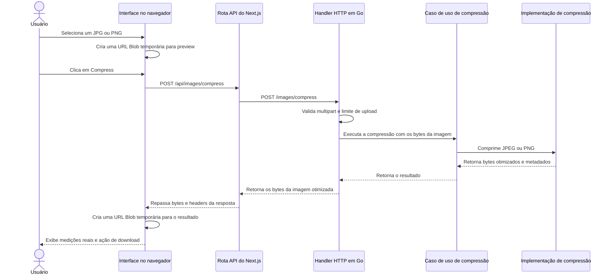

# Arquitetura

Este documento descreve a arquitetura atual, os trade-offs e a evolução esperada do Go Image Optimizer.

O projeto evolui de forma incremental. Novos componentes e padrões só devem ser introduzidos quando um requisito concreto ou uma limitação observada justificar essa complexidade.

## 1. Contexto

Go Image Optimizer é uma aplicação para otimização de imagens com backend em Go e interface web construída com Next.js, React e Tailwind CSS.

A implementação atual entrega o primeiro fluxo utilizável de compressão para:

- JPEG / JPG
- PNG

WebP, AVIF, redimensionamento, thumbnails, conversão de formato, histórico de processamento e processamento assíncrono ainda não fazem parte da implementação atual.

## 2. Fluxo atual da requisição



O navegador mantém o preview da imagem selecionada e o resultado comprimido apenas em estado React e URLs Blob. Essas URLs são revogadas quando são substituídas, quando o fluxo é reiniciado ou quando o componente é desmontado. Ao recarregar a página, a sessão atual desaparece de forma intencional.

## 3. Fronteiras no backend

O backend agora possui uma fronteira pequena, mas real, de aplicação:

```text
Handler HTTP
    -> Caso de uso de compressão de imagem
        -> Implementação de compressão de imagem
```

Responsabilidades atuais:

- Handler HTTP: leitura do multipart, limite de 25 MiB, validação dos campos, status codes, headers de resposta e geração do nome de download.
- Caso de uso de compressão: execução da regra de aplicação e checagens de contexto, sem depender de HTTP ou tipos de multipart.
- Implementação de compressão: identificação do conteúdo real, validação da imagem, proteção por dimensão, decode, encode específico por formato e configurações de compressão.

O projeto ainda não cria um modelo de domínio porque a funcionalidade atual não possui entidades de domínio relevantes. A interface do compressor existe como uma fronteira útil entre o caso de uso e a implementação de infraestrutura.

## 4. Comportamento da compressão

Imagens JPEG são decodificadas e reencodadas como JPEG com qualidade conservadora `82`. Essa compressão é lossy: a intenção é reduzir o tamanho do arquivo com baixa degradação visual perceptível para muitas imagens comuns. O valor fica nomeado no código para poder ser ajustado futuramente com base em medições e requisitos do produto.

Imagens PNG são decodificadas e reencodadas como PNG usando o melhor nível de compressão PNG disponível na biblioteca padrão do Go. Esse processo é lossless para o conteúdo dos pixels e preserva as dimensões da imagem. A redução obtida em PNG depende muito de como o arquivo original foi codificado.

A aplicação preserva as dimensões originais e o formato da resposta para imagens suportadas. Ela não promete que toda saída será menor; imagens já otimizadas podem ter pouca ou nenhuma redução.

## 5. Ciclo de vida dos arquivos e armazenamento

O ciclo de vida atual no backend é efêmero:

```text
Navegador
    -> POST da imagem
    -> Go recebe os bytes
    -> Go comprime em memória
    -> Go retorna os bytes otimizados
    -> Navegador mantém o resultado temporariamente
    -> Usuário baixa o resultado
```

Imagens enviadas e imagens comprimidas não são persistidas em armazenamento da aplicação. O backend não cria IDs de processamento, registros em banco de dados, registros no Redis, objetos em storage, URLs de resultado para busca posterior ou histórico de processamento.

Arquivos temporários de multipart, caso a biblioteca padrão crie algum durante o parsing da requisição, são removidos com `MultipartForm.RemoveAll()` antes do fim da requisição.

Essa é uma decisão atual do MVP, não uma rejeição permanente ao uso de armazenamento. Versões futuras podem introduzir armazenamento temporário ou persistente se processamento assíncrono, recuperação posterior, maior vazão ou histórico justificarem isso.

## 6. Processamento síncrono

Hoje a compressão roda de forma síncrona dentro da requisição HTTP em Go porque o MVP precisa apenas receber, processar e devolver a imagem imediatamente.

A aplicação não declara características de alta vazão ou escalabilidade. Qualquer afirmação desse tipo precisa ser medida em cargas realistas antes de entrar na documentação.

Proteções leves de recursos na implementação atual:

- O corpo da requisição é limitado a 25 MiB.
- O parsing multipart mantém até 8 MiB em memória antes de a biblioteca padrão poder usar arquivos temporários.
- As dimensões decodificadas são limitadas a 32 megapixels para reduzir riscos óbvios de expansão excessiva na decodificação.

## 7. Ciclo de vida no frontend

O frontend mantém o fluxo em estado React:

- drop zone inicial;
- preview da imagem selecionada e tamanho original;
- ação explícita de Compress;
- estado de carregamento indeterminado;
- preview do resultado, medições reais em bytes, cálculo de redução e ação de download;
- reinício do fluxo para outra imagem.

A interface não persiste a sessão em `localStorage`, IndexedDB, armazenamento do backend ou qualquer outro armazenamento durável. Após recarregar a página, a imagem selecionada e o resultado desaparecem por decisão do MVP.

## 8. Limitações atuais

- Apenas JPEG/JPG e PNG são suportados.
- A compressão JPEG é lossy.
- A compressão PNG é lossless para pixels, mas a redução depende da codificação original.
- A preservação de metadados não é garantida.
- O backend retorna o resultado de forma síncrona e não expõe eventos reais de progresso, então o frontend mostra um indicador indeterminado.
- Algumas saídas podem ter o mesmo tamanho ou ficar maiores que o arquivo enviado.
- Não há histórico, busca por ID, worker em background, fila, object storage ou limpeza por TTL.

## 9. Possível evolução

Se requisitos futuros exigirem processamento assíncrono, arquivos maiores, formatos mais pesados, maior vazão, compartilhamento de resultados ou histórico, a arquitetura pode evoluir para algo como:

```text
Upload
    -> ID de processamento
    -> Fila / worker
    -> Armazenamento temporário ou object storage
    -> Recuperação do resultado
    -> Limpeza por TTL
```

Essa direção deve ser introduzida somente com requisitos claros e trade-offs documentados sobre armazenamento, retenção, limpeza, observabilidade, segurança e custo operacional.
