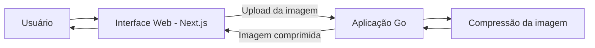
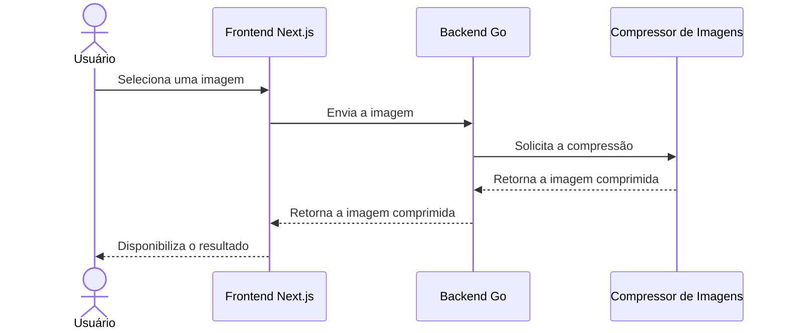

# Arquitetura

Este documento descreve as decisões arquiteturais, os trade-offs e a evolução do Go Image Optimizer.

A arquitetura será desenvolvida de forma intencionalmente incremental. Novos componentes e padrões devem ser introduzidos em resposta a requisitos, limitações ou problemas técnicos concretos, e não apenas com base em uma complexidade antecipada.

## 1. Contexto

Go Image Optimizer é uma aplicação para otimização de imagens com backend desenvolvido em Go e uma interface web construída com Next.js, React e Tailwind CSS.

O escopo inicial de desenvolvimento está focado exclusivamente na compressão de imagens.

Outras funcionalidades de otimização estão planejadas, mas não serão consideradas parte da implementação atual até que sejam efetivamente desenvolvidas.

## 2. Requisitos atuais

Inicialmente, a aplicação deverá permitir que o usuário:

1. Selecione uma imagem pela interface web.
2. Envie a imagem para o backend em Go.
3. Processe a imagem utilizando compressão.
4. Receba a imagem comprimida como resultado.

Neste estágio, a arquitetura deverá permanecer simples, mas fornecer uma base que possa evoluir conforme novos requisitos surgirem.

## 3. Arquitetura inicial

A arquitetura inicial consiste em um frontend web que se comunica com um backend em Go responsável pelo processamento da imagem.

Inicialmente, a compressão da imagem será executada dentro da própria aplicação Go.

Essa decisão evita a introdução de serviços adicionais antes que exista um requisito concreto que justifique sua complexidade arquitetural e operacional.

## 4. Decisões arquiteturais

As decisões abaixo serão documentadas conforme o projeto evoluir.

### ADR-001 — Go para o backend

A ser discutido e documentado.

### ADR-002 — Next.js e React para a interface web

A ser discutido e documentado.

### ADR-003 — Tailwind CSS para estilização

A ser discutido e documentado.

### ADR-004 — Processamento de imagens dentro da aplicação Go

A ser discutido e documentado.

## 5. Fluxo da requisição

Para a funcionalidade inicial de compressão de imagens, o fluxo esperado é:

Esse fluxo representa a direção arquitetural atual e poderá mudar conforme as decisões de implementação forem tomadas.

## 6. Limitações atuais

O projeto está em seu estágio inicial de desenvolvimento.

Características de performance, limites de concorrência, formatos de imagem suportados, estratégias de compressão, requisitos de armazenamento e limites de escalabilidade ainda não foram definidos ou validados.

Esses aspectos serão documentados com base em decisões reais de implementação e medições, e não em suposições.

## 7. Evolução da arquitetura

A arquitetura deverá evoluir junto com o projeto.

Possíveis mudanças arquiteturais serão avaliadas quando novos requisitos ou limitações observadas fornecerem uma razão concreta para introduzir complexidade adicional.

Cada mudança arquitetural significativa deverá documentar:

- O problema que está sendo resolvido.
- As alternativas disponíveis.
- Os trade-offs considerados.
- A abordagem escolhida.
- O raciocínio por trás da decisão.
- As consequências da decisão.
