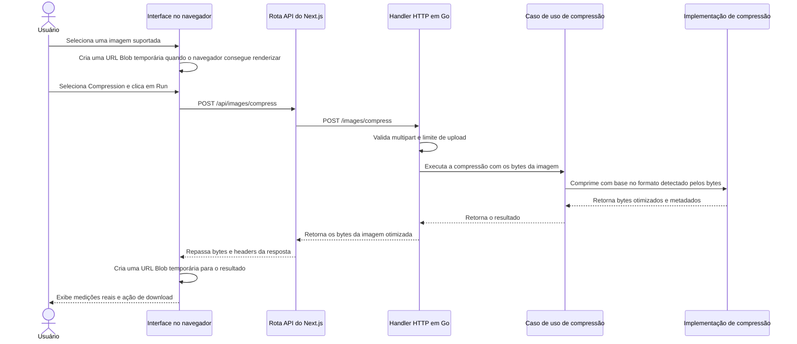

# Arquitetura

Este documento descreve a arquitetura atual, os trade-offs e a evolução esperada do Go Image Optimizer.

O projeto evolui de forma incremental. Novos componentes e padrões só devem ser introduzidos quando um requisito concreto ou uma limitação observada justificar essa complexidade.

## 1. Contexto

Go Image Optimizer é uma aplicação para otimização de imagens com backend em Go e interface web construída com Next.js, React e Tailwind CSS.

A implementação atual oferece Compressão e Resize síncronos para estas famílias de formato, sujeitas às restrições de variantes de cada funcionalidade descritas abaixo:

- JPEG / JPG
- PNG
- WebP
- AVIF
- HEIC / HEIF
- GIF
- BMP
- TIFF

WebM, SVG, formatos RAW de câmera, vídeos, arquivos compactados e formatos arbitrários de imagem não são suportados.

## 2. Fluxo de compressão



O navegador mantém o preview da imagem selecionada e o resultado comprimido apenas em estado React e URLs Blob. Essas URLs são revogadas quando são substituídas, quando o fluxo é reiniciado ou quando o componente é desmontado. Ao recarregar a página, a sessão atual desaparece de forma intencional.

Resumo do pipeline:

1. O navegador envia um upload multipart para a rota API do Next.js.
2. A rota do Next.js encaminha o form data para o backend Go.
3. O handler Go valida a estrutura multipart e o limite da requisição, depois passa os bytes da imagem para o caso de uso.
4. O compressor detecta o formato real pelos bytes antes de confiar em qualquer nome de arquivo ou MIME type.
5. O caminho de codec selecionado valida as dimensões decodificadas e, para animações, os limites de pixels de canvas-frame.
6. A imagem é decodificada, reencodada na mesma família de formato e retornada como bytes com metadados.
7. O handler devolve os bytes comprimidos com headers de content type, content length e nome de download.
8. O navegador mantém o resultado temporariamente em uma URL Blob até substituição, reset, desmontagem ou reload.

## 3. Fronteiras no backend

A compressão usa esta fronteira de aplicação:

```text
Handler HTTP
    -> Caso de uso de compressão de imagem
        -> Implementação de compressão de imagem
```

Responsabilidades atuais:

- Handler HTTP: leitura do multipart, limite de 50 MiB, validação dos campos, status codes, headers de resposta e geração do nome de download.
- Caso de uso de compressão: execução da regra de aplicação e checagens de contexto, sem depender de HTTP ou tipos de multipart.
- Implementação de compressão: identificação do conteúdo real pelos bytes, validação da imagem, proteção por dimensão e por animação, decode, encode específico por formato e configurações de compressão.

O projeto ainda não cria um modelo de domínio porque a funcionalidade atual não possui entidades de domínio relevantes. A interface do compressor existe como uma fronteira útil entre o caso de uso e a implementação de infraestrutura.

Essa estrutura é melhor descrita como uma arquitetura em camadas pequena e intencional, com separação entre transporte, aplicação e infraestrutura. Ela não é documentada como "Clean Architecture": o projeto aproveita algumas ideias úteis de fronteira, mas não precisa de entidades, repositories, factories ou frameworks de injeção de dependência no escopo atual.

### Fronteira de Resize e trade-off das requisições

```text
ImageUploadForm → ImageResizeModal
  → rota Next.js → handler resize_image
    → caso de uso application/imageresize
      → Decoder imaging/resize → Source local à requisição
        → cálculo das dimensões → reamostragem → encoder da família original
```

A aplicação define opções, regras de dimensões, interfaces de decodificação/origem, inspeção e execução. Imaging controla pixels e codecs. Tipos comuns de formato/resultado/erro ficam em `application/imageprocessing`, com aliases em compressão para compatibilidade. Decode/encode HEIF e nome seguro de download são compartilhados por necessidade real das duas funcionalidades.

Inspeção e execução são duas requisições síncronas. O arquivo é enviado e decodificado novamente ao executar. Essa escolha evita introduzir ID, cache persistente de upload, banco, Redis, fila, worker ou object storage apenas para configurar uma imagem.

O contexto é verificado antes/depois da decodificação e processamento e entre frames. Uma chamada individual de codec não é interrompida à força pelo cancelamento. Isso não representa processamento em background nem isolamento completo de CPU/memória.

## 4. Detecção de formato

O backend não confia na extensão do arquivo nem no MIME type informado pelo navegador. Ele inspeciona os bytes enviados e aceita apenas assinaturas e marcas de container conhecidas para os formatos suportados. Assinaturas de RAW de câmera, incluindo containers RAW baseados em TIFF como DNG e CR2, são rejeitadas em vez de serem direcionadas ao compressor TIFF.

Por isso, um JPEG enviado como `sample.png` ainda é processado como JPEG e retorna com extensão de download JPEG. Um arquivo chamado `broken.webp` com bytes que não são WebP é rejeitado em vez de ser encaminhado ao codec WebP.

## 5. Comportamento da compressão

A aplicação preserva a família do formato de origem para imagens suportadas. Ela não faz conversão visível entre formatos não relacionados.

Comportamento atual dos codecs:

- JPEG é decodificado, a orientação EXIF é aplicada aos pixels e a imagem é reencodada como JPEG com qualidade `82`.
- PNG é decodificado e reencodado como PNG com o melhor nível de compressão da biblioteca padrão. Pixels e alpha são lossless.
- WebP estático é decodificado e reencodado como WebP. Entrada WebP lossless continua lossless; alpha é preservado.
- WebP animado é decodificado pelo container de animação, reconstruído como frames de canvas completo e reencodado como WebP animado. Quantidade de frames, duração, loop, cor de fundo e chunks de metadados suportados são preservados, mas retângulos internos de sub-frame e escolhas de disposal podem ser normalizados pelo encoder.
- AVIF é decodificado e reencodado como AVIF. A rotação automática no decode fica habilitada. A implementação passa por `DecodeAll`/`EncodeAll`, mas a cobertura automatizada atual é para fixtures AVIF estáticas.
- HEIC/HEIF usa libheif e suporte HEVC nativos. O backend aceita uma imagem primária top-level e rejeita variantes multi-imagem não suportadas com `422`.
- GIF é decodificado com a biblioteca padrão do Go e reencodado como GIF. Frames, delays, disposal e loop de GIF animado são preservados por `gif.EncodeAll`.
- BMP é decodificado e reencodado como BMP. A saída BMP pode não ficar menor.
- TIFF é decodificado e reencodado como TIFF com compressão Deflate e predictor habilitado.

Arquivos já otimizados podem continuar com o mesmo tamanho ou ficar maiores. O frontend exibe medições reais de bytes em vez de presumir redução.

## Redimensionamento de imagens

### Fluxo de uso

Selecione uma imagem, escolha **Resize** e clique em **Run**. O modal de configuração abre sem mudar o layout da Home, consulta as dimensões no backend e mostra o preview original (ou fallback do navegador) e as dimensões previstas da saída.

- **Pixels** começa com as dimensões originais, considerando a orientação de exibição. **Keep aspect ratio** vem marcado. A última dimensão editada determina o cálculo proporcional da outra. Destravar permite distorcer a proporção; não há recorte nem preenchimento.
- **Percentage** oferece **25% smaller**, **50% smaller** e **75% smaller**, com 50% selecionado inicialmente. A porcentagem reduz largura e altura, não os bytes nem a área total de pixels.
- O arredondamento é para o inteiro mais próximo, com mínimo de um pixel. Reduzir 899 × 1599 em 50% resulta em 450 × 800.
- Pixels permite ampliar dentro dos limites de recursos. O resumo mostra as dimensões efetivas e uma nota discreta explica que ampliar não adiciona detalhes.
- **Resize image** executa a operação. **Cancel**, o botão de fechar e Escape fecham a configuração quando não há processamento. Clicar no fundo não fecha. Durante o processamento, opções e fechamento ficam desabilitados; o carregamento é indeterminado.
- O resultado substitui o modal de configuração e mostra dimensões e tamanhos reais, preview/fallback e download. O modal de resultado mantém o fechamento explícito existente.
- O original continua selecionado para outra operação. Reabrir a configuração restaura os valores iniciais. Erros de processamento mantêm as opções; erros na leitura de dimensões oferecem uma ação de tentar novamente.

O modal de configuração usa dialog nativo para conter o foco e tornar o fundo inativo, foco inicial no título, abas navegáveis por teclado, bloqueio de rolagem do body e restauração do foco. Em telas estreitas, vira uma coluna com conteúdo rolável e rodapé fixo dentro do modal.

### API

As duas rotas recebem `multipart/form-data` com exatamente um arquivo no campo `image`. Formato e dimensões vêm dos bytes reais; MIME do navegador, extensão e dimensões informadas pelo cliente não são fontes de verdade.

#### POST /images/resize/info

Retorna JSON, por exemplo:

```json
{"width":899,"height":1599,"format":"jpeg","contentType":"image/jpeg","frameCount":1}
```

A inspeção valida e decodifica a origem, sem recodificar nem persistir. As dimensões consideram a orientação EXIF de JPEG e a orientação nativa suportada. Isso funciona também quando o navegador não consegue gerar preview. A leitura pode custar mais em imagens grandes/codecs nativos; o modal mostra carregamento. Fechar o modal aborta a requisição no navegador.

#### POST /images/resize

| Campo | Contrato |
| --- | --- |
| `mode` | Obrigatório: `pixels` ou `percentage` |
| `width`, `height` | Obrigatórios em pixels: inteiros positivos, individualmente até 32.000.000; a saída efetiva também deve respeitar o limite total de pixels |
| `axis` | `width` (padrão) ou `height`: última dimensão editada, usada no cálculo proporcional |
| `keepAspectRatio` | `true` (padrão) ou `false`; aplica-se ao modo pixels |
| `reduction` | Obrigatório em percentage: `25`, `50` ou `75` |

Booleanos usam literalmente `true`/`false`; valores explicitamente vazios são rejeitados. Os padrões valem quando o campo é omitido. Opções repetidas, arquivos adicionais e campos `image` misturando texto e arquivo são rejeitados. A interface envia números válidos como inteiros decimais, inclusive quando digitados em notação exponencial. Percentage ignora largura/altura e sempre preserva proporção. O servidor recalcula a saída a partir do arquivo enviado; dimensões de origem não são controladas pelo cliente. A operação sempre parte do original selecionado, nunca de um resultado anterior.

A resposta de sucesso contém os bytes e:

- `Content-Type`, `Content-Length` e `Content-Disposition` com nome sanitizado `*_resized` e extensão da família real;
- `X-Original-Width`, `X-Original-Height`, `X-Image-Width`, `X-Image-Height`, em pixels com orientação de exibição;
- `Cache-Control: no-store`.

Erros retornam JSON `{ "error": "..." }`: 400 para input/opções inválidos, 413 para limites, 415 para formato não suportado, 422 para variante não suportada e 500 para falhas internas/de codec. O proxy Next.js retorna 502 quando não consegue acessar o backend.

As rotas de mesma origem no Next.js são `/api/images/resize/info` e `/api/images/resize`. Um helper de encaminhamento, compartilhado com compressão, repassa multipart, status, MIME, nome e headers de dimensões.

### Comportamento e limites

- JPEG, PNG, WebP, AVIF estático, HEIC/HEIF suportado com uma imagem, GIF, BMP e TIFF de uma página mantêm sua família de formato. A compressão existente mantém seu suporte anterior.
- A orientação EXIF de JPEG é normalizada antes do cálculo. AVIF/HEIF seguem o comportamento de orientação dos codecs nativos instalados.
- A reamostragem Catmull–Rom trabalha em RGBA pré-multiplicado. Alpha de PNG/WebP é preservado; resize altera pixels, portanto não é uma operação pixel-identical. BMP mantém as limitações de seu encoder.
- Frames parciais de GIF são compostos respeitando disposal antes da reamostragem. A saída usa frames de canvas completo, paleta web-safe, transparência binária, delays e loop originais. Quantização de cores/paleta e representação interna de disposal podem mudar.
- WebP animado preserva os frames reconstruídos, tempos, loop, fundo e ICC quando presente. O Resize não copia EXIF/XMP para evitar dimensões/orientação desatualizadas. Não há preservação universal de metadados.
- **AVIF animado é rejeitado.** O decoder `gen2brain/avif` v0.6.0 fornece frames e delays, mas não preenche `LoopCount`; por isso não é possível prometer preservação de loops finitos. APNG, TIFF multipágina e HEIF multi-imagem não suportado também são rejeitados, sem achatamento silencioso.
- Os limites compartilhados abaixo valem para inspeção e execução. Resize também limita a saída a **32 milhões de pixels** e a saída animada a **64 milhões de pixels de canvas-frame**. Descritores GIF e quantidade de frames do container WebP são verificados antes da decodificação completa.
- Se as dimensões efetivas forem iguais às originais de exibição, os bytes originais são devolvidos intactos, preservando metadados e evitando recodificação com perda desnecessária.
- Nos demais casos, os parâmetros de encode acompanham os padrões existentes (JPEG/WebP 82, AVIF/HEIF 60; PNG best compression; TIFF Deflate). O resultado pode ser maior em bytes. Não há lote, recorte, conversão, histórico, progresso percentual nem promessa de ganho de detalhe.

Consulte a [documentação de testes](../../TESTS_README.pt-BR.md) para cobertura automatizada e validação da interface.

## 6. Ciclo de vida dos arquivos e armazenamento

O ciclo de vida atual no backend é efêmero:

```text
Navegador
    -> POST da imagem
    -> Go recebe os bytes
    -> Go comprime ou redimensiona os bytes
    -> Go retorna os bytes otimizados
    -> Navegador mantém o resultado temporariamente
    -> Usuário baixa o resultado
```

Imagens enviadas e imagens processadas não são persistidas em armazenamento da aplicação. O backend não cria IDs de processamento, registros em banco de dados, registros no Redis, objetos em storage, URLs de resultado, filas, jobs em background, histórico de processamento ou limpeza por TTL.

`storage/testdata/images` é um diretório versionado de fixtures de teste. Ele contém arquivos reais de entrada para testes de integração e não é usado pela aplicação em execução para uploads ou resultados. Os testes leem essas fixtures e mantêm as saídas comprimidas em memória ou em caminhos temporários do sistema operacional.

Arquivos temporários de multipart, caso a biblioteca padrão crie algum durante o parsing da requisição, são removidos com `MultipartForm.RemoveAll()` antes do fim da requisição.

A codificação HEIC/HEIF usa internamente a API de saída para arquivo do binding Go da libheif. O compressor escreve em um arquivo temporário do sistema operacional, lê o resultado de volta para memória e remove esse arquivo temporário antes de devolver a resposta. Isso não cria armazenamento durável da aplicação.

## 7. Processamento síncrono

Compressão e Resize rodam de forma síncrona dentro da requisição HTTP em Go porque a aplicação devolve um download imediato.

A aplicação não declara características de alta vazão ou escalabilidade. Qualquer afirmação desse tipo precisa ser medida em cargas realistas antes de entrar na documentação.

Proteções atuais de recursos:

- O corpo da requisição é limitado a 50 MiB.
- O parsing multipart mantém até 8 MiB em memória antes de a biblioteca padrão poder usar arquivos temporários.
- As dimensões decodificadas são limitadas a 32 megapixels.
- GIF animado, WebP animado e AVIF com múltiplos frames são limitados por `largura * altura * quantidade de frames`, com limite padrão de 64 milhões de pixels de canvas-frame.

## 8. Ciclo de vida no frontend

O frontend é uma aplicação Next.js. `app/page.tsx` permanece como camada de composição da Home e delega seções específicas da Home para `app/components/home/*`. `ImageUploadForm` mantém o estado client-side de seleção, envio e resultado em `app/components/image-upload/`, enquanto componentes filhos locais da feature cuidam da drop zone, controles de operação, modal de resultado, preview no navegador, métricas de resultado, ícones, tipos e lógica auxiliar de imagem/arquivo. As rotas Next.js em `app/api/images/` encaminham requisições multipart para o backend Go preservando headers relevantes da resposta.

O frontend mantém o fluxo em estado React:

- drop zone inicial;
- preview da imagem selecionada quando o navegador consegue renderizar o formato;
- placeholder sem preview para formatos que muitos navegadores não renderizam, como HEIC ou TIFF;
- tamanho original do arquivo;
- seleção de operação e ação explícita de Run;
- configuração de Resize com inspeção da origem e dimensões efetivas;
- estado de carregamento indeterminado;
- preview do resultado quando o navegador consegue renderizar;
- medições reais em bytes, cálculo de redução e ação de download;
- reinício do fluxo para outra imagem.

A interface não persiste a sessão em `localStorage`, IndexedDB, armazenamento do backend ou qualquer outro armazenamento durável. Após recarregar a página, a imagem selecionada e o resultado desaparecem por decisão da aplicação.

## 9. Fronteira entre containers frontend e backend

Os containers separados de frontend e backend são intencionais. O frontend precisa de build e runtime Node/Next.js; o backend precisa de build Go, CGO e pacotes nativos da libheif em runtime para HEIC/HEIF. Juntar esses containers deixaria a imagem de runtime maior sem simplificar a arquitetura atual.

O serviço Compose `backend-test` é uma conveniência local de teste/desenvolvimento, não um serviço de produção. Ele usa o estágio de build do backend para que o toolchain Go e headers nativos estejam disponíveis nos testes, enquanto o serviço de produção `backend` permanece mínimo.

## 10. Decisão sobre codecs nativos

O suporte a HEIC/HEIF exige libheif nativa e plugins de codec HEVC no Docker. Por isso, a imagem do backend usa build Alpine com CGO habilitado e runtime Alpine com pacotes libheif, em vez de uma imagem distroless totalmente estática.

Consulte [ADR 001: Codecs nativos de imagem](adr-001-codecs-nativos.md) e [Docker](docker.md).

## 11. Limitações atuais

- Compressão e Resize são síncronos.
- Preservação de metadados é best-effort e específica por formato, não uma garantia universal.
- Variantes não suportadas são rejeitadas em vez de aproximadas.
- Algumas saídas podem ter o mesmo tamanho ou ficar maiores que o arquivo enviado.
- O suporte de preview no navegador varia por formato.
- Não há histórico, busca por ID, worker em background, fila, banco de dados, object storage ou limpeza por TTL.

## 12. Possível evolução

FUTURO / CONSIDERADO: se requisitos futuros exigirem processamento assíncrono, arquivos maiores, formatos mais pesados, maior vazão medida, compartilhamento de resultados ou histórico, a arquitetura pode evoluir para algo como:

```text
Upload
    -> ID de processamento
    -> Fila / worker
    -> Armazenamento temporário ou object storage
    -> Recuperação do resultado
    -> Limpeza por TTL
```

Essa direção não está implementada hoje. Ela deve ser introduzida somente com requisitos claros e trade-offs documentados sobre armazenamento, retenção, limpeza, observabilidade, segurança e custo operacional.
