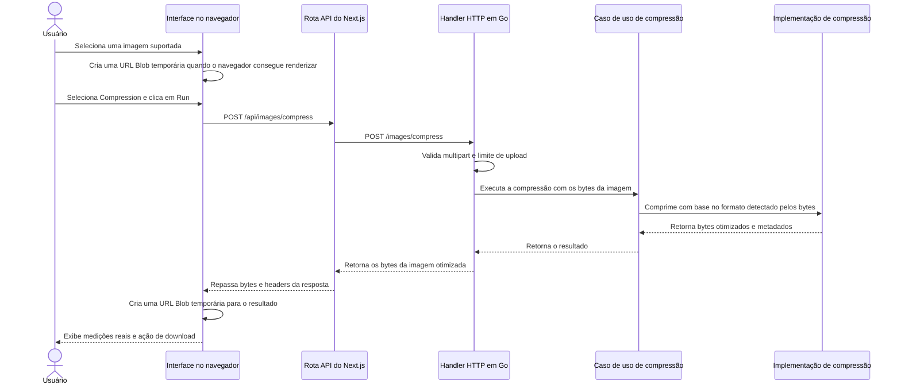

# Arquitetura

[English](../en/architecture.md) | [Português](architecture.md)

Este documento descreve a arquitetura atual, os trade-offs e o escopo funcional concluído do Go Image Optimizer.

O escopo funcional atual está concluído. A arquitetura permanece focada; manutenção e correções continuam possíveis, sem funcionalidades adicionais planejadas.

## 1. Contexto

Go Image Optimizer é uma aplicação para otimização de imagens com backend em Go e interface web construída com Next.js, React e Tailwind CSS.

A implementação atual oferece Compressão, Resize e conversão síncronos, além de fallback de prévia compatível com navegadores, para estas famílias de formato, sujeitas às restrições de variantes de cada funcionalidade descritas abaixo:

- JPEG / JPG
- PNG
- WebP
- AVIF
- HEIC / HEIF
- GIF
- BMP
- TIFF

WebM, SVG, formatos RAW de câmera, vídeos, arquivos compactados e formatos arbitrários de imagem não são suportados.

## 2. Fluxo de compressão


```mermaid
sequenceDiagram
    actor User as Usuário
    participant Browser as Interface no navegador
    participant NextAPI as Rota API do Next.js
    participant Handler as Handler HTTP em Go
    participant UseCase as Caso de uso de compressão
    participant Compressor as Implementação de compressão

    User->>Browser: Seleciona uma imagem suportada
    Browser->>Browser: Cria uma URL Blob temporária quando o navegador consegue renderizar
    User->>Browser: Seleciona Compression e clica em Run
    Browser->>NextAPI: POST /api/images/compress
    NextAPI->>Handler: POST /images/compress
    Handler->>Handler: Valida multipart e limite de upload
    Handler->>UseCase: Executa a compressão com os bytes da imagem
    UseCase->>Compressor: Comprime com base no formato detectado pelos bytes
    Compressor-->>UseCase: Retorna bytes otimizados e metadados
    UseCase-->>Handler: Retorna o resultado
    Handler-->>NextAPI: Retorna os bytes da imagem otimizada
    NextAPI-->>Browser: Repassa bytes e headers da resposta
    Browser->>Browser: Cria uma URL Blob temporária para o resultado
    Browser-->>User: Exibe medições reais e ação de download
```

O navegador mantém o preview da imagem selecionada e o resultado comprimido apenas em estado React e URLs Blob. Essas URLs são revogadas quando são substituídas, quando o fluxo é reiniciado ou quando o componente é desmontado. Ao recarregar a página, a sessão atual desaparece de forma intencional.

Resumo do pipeline:

1. O navegador envia um upload multipart para a rota API do Next.js.
2. A rota do Next.js encaminha o form data para o backend Go.
3. O handler Go valida a estrutura multipart e o limite da requisição, depois passa os bytes da imagem para o caso de uso.
4. O compressor detecta o formato real pelos bytes antes de confiar em qualquer nome de arquivo ou MIME type.
5. O caminho de codec selecionado valida as dimensões decodificadas e, para animações, os limites de pixels de canvas-frame.
6. A imagem é decodificada, reencodada na mesma família de formato e retornada como bytes com metadados.
7. O handler devolve os bytes comprimidos com headers de content type, content length e nome de download.
8. O navegador mantém o resultado temporariamente em uma URL Blob até substituição, reset, desmontagem ou reload.

## 3. Fronteiras no backend

A compressão usa esta fronteira de aplicação:

```text
Handler HTTP
    -> Caso de uso de compressão de imagem
        -> Implementação de compressão de imagem
```

Responsabilidades atuais:

- Handler HTTP: leitura do multipart, limite de 50 MiB, validação dos campos, status codes, headers de resposta e geração do nome de download.
- Caso de uso de compressão: execução da regra de aplicação e checagens de contexto, sem depender de HTTP ou tipos de multipart.
- Implementação de compressão: identificação do conteúdo real pelos bytes, validação da imagem, proteção por dimensão e por animação, decode, encode específico por formato e configurações de compressão.

O projeto ainda não cria um modelo de domínio porque a funcionalidade atual não possui entidades de domínio relevantes. A interface do compressor existe como uma fronteira útil entre o caso de uso e a implementação de infraestrutura.

Essa estrutura é melhor descrita como uma arquitetura em camadas pequena e intencional, com separação entre transporte, aplicação e infraestrutura. Ela não é documentada como "Clean Architecture": o projeto aproveita algumas ideias úteis de fronteira, mas não precisa de entidades, repositories, factories ou frameworks de injeção de dependência no escopo atual.

### Fronteira de Resize e trade-off das requisições

```text
ImageUploadForm → ImageResizeModal
  → rota Next.js → handler resize_image
    → caso de uso application/imageresize
      → Decoder imaging/resize → Source local à requisição
        → cálculo das dimensões → reamostragem → encoder da família original
```

A aplicação define opções, regras de dimensões, interfaces de decodificação/origem, inspeção e execução. Imaging controla pixels e codecs. Tipos comuns de formato/resultado/erro ficam em `application/imageprocessing`, com aliases em compressão para compatibilidade. Decode/encode HEIF e nome seguro de download são compartilhados por necessidade real das duas funcionalidades.

Inspeção e execução são duas requisições síncronas. O arquivo é enviado e decodificado novamente ao executar. Essa escolha evita introduzir ID, cache persistente de upload, banco, Redis, fila, worker ou object storage apenas para configurar uma imagem.

O contexto é verificado antes/depois da decodificação e processamento e entre frames. Uma chamada individual de codec não é interrompida à força pelo cancelamento. Isso não representa processamento em background nem isolamento completo de CPU/memória.

## 4. Detecção de formato

O backend não confia na extensão do arquivo nem no MIME type informado pelo navegador. Ele inspeciona os bytes enviados e aceita apenas assinaturas e marcas de container conhecidas para os formatos suportados. Assinaturas de RAW de câmera, incluindo containers RAW baseados em TIFF como DNG e CR2, são rejeitadas em vez de serem direcionadas ao compressor TIFF.

Por isso, um JPEG enviado como `sample.png` ainda é processado como JPEG e retorna com extensão de download JPEG. Um arquivo chamado `broken.webp` com bytes que não são WebP é rejeitado em vez de ser encaminhado ao codec WebP.

## 5. Comportamento da compressão

A operação de compressão preserva a família de origem para imagens suportadas. A conversão de formatos é uma operação separada já implementada.

Comportamento atual dos codecs:

- JPEG é decodificado, a orientação EXIF é aplicada aos pixels e a imagem é reencodada como JPEG com qualidade `82`.
- PNG é decodificado e reencodado como PNG com o melhor nível de compressão da biblioteca padrão. Pixels e alpha são lossless.
- WebP estático é decodificado e reencodado como WebP. Entrada WebP lossless continua lossless; alpha é preservado.
- WebP animado é decodificado pelo container de animação, reconstruído como frames de canvas completo e reencodado como WebP animado. Quantidade de frames, duração, loop, cor de fundo e chunks de metadados suportados são preservados, mas retângulos internos de sub-frame e escolhas de disposal podem ser normalizados pelo encoder.
- AVIF é decodificado e reencodado como AVIF. A rotação automática no decode fica habilitada. A implementação passa por `DecodeAll`/`EncodeAll`, mas a cobertura automatizada atual é para fixtures AVIF estáticas.
- HEIC/HEIF usa libheif e suporte HEVC nativos. O backend aceita uma imagem primária top-level e rejeita variantes multi-imagem não suportadas com `422`.
- GIF é decodificado com a biblioteca padrão do Go e reencodado como GIF. Frames, delays, disposal e loop de GIF animado são preservados por `gif.EncodeAll`.
- BMP é decodificado e reencodado como BMP. A saída BMP pode não ficar menor.
- TIFF é decodificado e reencodado como TIFF com compressão Deflate e predictor habilitado.

Arquivos já otimizados podem continuar com o mesmo tamanho ou ficar maiores. O frontend exibe medições reais de bytes em vez de presumir redução.

## Redimensionamento de imagens

### Fluxo de uso

Selecione uma imagem, escolha **Resize** e clique em **Run**. O modal de configuração abre sem mudar o layout da Home, consulta as dimensões no backend e mostra o preview original (ou fallback do navegador) e as dimensões previstas da saída.

- **Pixels** começa com as dimensões originais, considerando a orientação de exibição. **Keep aspect ratio** vem marcado. A última dimensão editada determina o cálculo proporcional da outra. Destravar permite distorcer a proporção; não há recorte nem preenchimento.
- **Percentage** oferece **25% smaller**, **50% smaller** e **75% smaller**, com 50% selecionado inicialmente. A porcentagem reduz largura e altura, não os bytes nem a área total de pixels.
- O arredondamento é para o inteiro mais próximo, com mínimo de um pixel. Reduzir 899 × 1599 em 50% resulta em 450 × 800.
- Pixels permite ampliar dentro dos limites de recursos. O resumo mostra as dimensões efetivas e uma nota discreta explica que ampliar não adiciona detalhes.
- **Resize image** executa a operação. **Cancel**, o botão de fechar e Escape fecham a configuração quando não há processamento. Clicar no fundo não fecha. Durante o processamento, opções e fechamento ficam desabilitados; o carregamento é indeterminado.
- O resultado substitui o modal de configuração e mostra dimensões e tamanhos reais, preview/fallback e download. O modal de resultado mantém o fechamento explícito existente.
- O original continua selecionado para outra operação. Reabrir a configuração restaura os valores iniciais. Erros de processamento mantêm as opções; erros na leitura de dimensões oferecem uma ação de tentar novamente.

O modal de configuração usa dialog nativo para conter o foco e tornar o fundo inativo, foco inicial no título, abas navegáveis por teclado, bloqueio de rolagem do body e restauração do foco. Em telas estreitas, vira uma coluna com conteúdo rolável e rodapé fixo dentro do modal.

### API

As duas rotas recebem `multipart/form-data` com exatamente um arquivo no campo `image`. Formato e dimensões vêm dos bytes reais; MIME do navegador, extensão e dimensões informadas pelo cliente não são fontes de verdade.

#### POST /images/resize/info

Retorna JSON, por exemplo:

```json
{"width":899,"height":1599,"format":"jpeg","contentType":"image/jpeg","frameCount":1}
```

A inspeção valida e decodifica a origem, sem recodificar nem persistir. As dimensões consideram a orientação EXIF de JPEG e a orientação nativa suportada. Isso funciona também quando o navegador não consegue gerar preview. A leitura pode custar mais em imagens grandes/codecs nativos; o modal mostra carregamento. Fechar o modal aborta a requisição no navegador.

#### POST /images/resize

| Campo | Contrato |
| --- | --- |
| `mode` | Obrigatório: `pixels` ou `percentage` |
| `width`, `height` | Obrigatórios em pixels: inteiros positivos, individualmente até 32.000.000; a saída efetiva também deve respeitar o limite total de pixels |
| `axis` | `width` (padrão) ou `height`: última dimensão editada, usada no cálculo proporcional |
| `keepAspectRatio` | `true` (padrão) ou `false`; aplica-se ao modo pixels |
| `reduction` | Obrigatório em percentage: `25`, `50` ou `75` |

Booleanos usam literalmente `true`/`false`; valores explicitamente vazios são rejeitados. Os padrões valem quando o campo é omitido. Opções repetidas, arquivos adicionais e campos `image` misturando texto e arquivo são rejeitados. A interface envia números válidos como inteiros decimais, inclusive quando digitados em notação exponencial. Percentage ignora largura/altura e sempre preserva proporção. O servidor recalcula a saída a partir do arquivo enviado; dimensões de origem não são controladas pelo cliente. A operação sempre parte do original selecionado, nunca de um resultado anterior.

A resposta de sucesso contém os bytes e:

- `Content-Type`, `Content-Length` e `Content-Disposition` com nome sanitizado `*_resized` e extensão da família real;
- `X-Original-Width`, `X-Original-Height`, `X-Image-Width`, `X-Image-Height`, em pixels com orientação de exibição;
- `Cache-Control: no-store`.

Erros retornam JSON `{ "error": "..." }`: 400 para input/opções inválidos, 413 para limites, 415 para formato não suportado, 422 para variante não suportada e 500 para falhas internas/de codec. O proxy Next.js retorna 502 quando não consegue acessar o backend.

As rotas de mesma origem no Next.js são `/api/images/resize/info` e `/api/images/resize`. Um helper de encaminhamento, compartilhado com compressão, repassa multipart, status, MIME, nome e headers de dimensões.

### Comportamento e limites

- JPEG, PNG, WebP, AVIF estático, HEIC/HEIF suportado com uma imagem, GIF, BMP e TIFF de uma página mantêm sua família de formato. A compressão existente mantém seu suporte anterior.
- A orientação EXIF de JPEG é normalizada antes do cálculo. AVIF/HEIF seguem o comportamento de orientação dos codecs nativos instalados.
- A reamostragem Catmull–Rom trabalha em RGBA pré-multiplicado. Alpha de PNG/WebP é preservado; resize altera pixels, portanto não é uma operação pixel-identical. BMP mantém as limitações de seu encoder.
- Frames parciais de GIF são compostos respeitando disposal antes da reamostragem. A saída usa frames de canvas completo, paleta web-safe, transparência binária, delays e loop originais. Quantização de cores/paleta e representação interna de disposal podem mudar.
- WebP animado preserva os frames reconstruídos, tempos, loop, fundo e ICC quando presente. O Resize não copia EXIF/XMP para evitar dimensões/orientação desatualizadas. Não há preservação universal de metadados.
- **AVIF animado é rejeitado.** O decoder `gen2brain/avif` v0.6.0 fornece frames e delays, mas não preenche `LoopCount`; por isso não é possível prometer preservação de loops finitos. APNG, TIFF multipágina e HEIF multi-imagem não suportado também são rejeitados, sem achatamento silencioso.
- Os limites compartilhados abaixo valem para inspeção e execução. Resize também limita a saída a **32 milhões de pixels** e a saída animada a **64 milhões de pixels de canvas-frame**. Descritores GIF e quantidade de frames do container WebP são verificados antes da decodificação completa.
- Se as dimensões efetivas forem iguais às originais de exibição, os bytes originais são devolvidos intactos, preservando metadados e evitando recodificação com perda desnecessária.
- Nos demais casos, os parâmetros de encode acompanham os padrões existentes (JPEG/WebP 82, AVIF/HEIF 60; PNG best compression; TIFF Deflate). O resultado pode ser maior em bytes. Resize não recorta, converte formatos, processa lotes nem melhora detalhes. Conversão é outra operação; histórico e progresso percentual estão fora do escopo atual.

Consulte a [documentação de testes](testing.md) para cobertura automatizada e validação da interface.

## 6. Ciclo de vida dos arquivos e armazenamento

O ciclo de vida atual no backend é efêmero:

```text
Navegador
    -> POST da imagem
    -> Go recebe os bytes
    -> Go comprime, redimensiona ou converte os bytes
    -> Go retorna os bytes otimizados
    -> Navegador mantém o resultado temporariamente
    -> Usuário baixa o resultado
```

Imagens enviadas e imagens processadas não são persistidas em armazenamento da aplicação. O backend não cria IDs de processamento, registros em banco de dados, registros no Redis, objetos em storage, URLs de resultado, filas, jobs em background, histórico de processamento ou limpeza por TTL.

`storage/testdata/images` é um diretório versionado de fixtures de teste. Ele contém arquivos reais de entrada para testes de integração e não é usado pela aplicação em execução para uploads ou resultados. Os testes leem essas fixtures e mantêm as saídas comprimidas em memória ou em caminhos temporários do sistema operacional.

Arquivos temporários de multipart, caso a biblioteca padrão crie algum durante o parsing da requisição, são removidos com `MultipartForm.RemoveAll()` antes do fim da requisição.

A codificação HEIC/HEIF usa internamente a API de saída para arquivo do binding Go da libheif. O compressor escreve em um arquivo temporário do sistema operacional, lê o resultado de volta para memória e remove esse arquivo temporário antes de devolver a resposta. Isso não cria armazenamento durável da aplicação.

## 7. Processamento síncrono

Compressão, Resize, conversão e fallback de prévia rodam de forma síncrona dentro da requisição HTTP em Go porque a aplicação devolve um download imediato.

A aplicação não declara características de alta vazão ou escalabilidade. Qualquer afirmação desse tipo precisa ser medida em cargas realistas antes de entrar na documentação.

Proteções atuais de recursos:

- O corpo da requisição é limitado a 50 MiB.
- O parsing multipart mantém até 8 MiB em memória antes de a biblioteca padrão poder usar arquivos temporários.
- As dimensões decodificadas são limitadas a 32 megapixels.
- GIF animado, WebP animado e AVIF com múltiplos frames são limitados por `largura * altura * quantidade de frames`, com limite padrão de 64 milhões de pixels de canvas-frame.

## 8. Ciclo de vida no frontend

O frontend é uma aplicação Next.js. `app/page.tsx` permanece como camada de composição da Home e delega seções específicas da Home para `app/components/home/*`. `ImageUploadForm` mantém o estado client-side de seleção, envio e resultado em `app/components/image-upload/`, enquanto componentes filhos locais da feature cuidam da drop zone, controles de operação, modal de resultado, preview no navegador, métricas de resultado, ícones, tipos e lógica auxiliar de imagem/arquivo. As rotas Next.js em `app/api/images/` encaminham requisições multipart para o backend Go preservando headers relevantes da resposta.

O frontend mantém o fluxo em estado React:

- drop zone inicial;
- preview da imagem selecionada quando o navegador consegue renderizar o formato;
- fallback de miniatura no backend quando o carregamento nativo falha;
- tamanho original do arquivo;
- seleção de operação e ação explícita de Run;
- configuração de Resize com inspeção da origem e dimensões efetivas;
- estado de carregamento indeterminado;
- preview do resultado quando o navegador consegue renderizar;
- medições reais em bytes, cálculo de redução e ação de download;
- reinício do fluxo para outra imagem.

A interface não persiste a sessão em `localStorage`, IndexedDB, armazenamento do backend ou qualquer outro armazenamento durável. Após recarregar a página, a imagem selecionada e o resultado desaparecem por decisão da aplicação.

## 9. Fronteira entre containers frontend e backend

Os containers separados de frontend e backend são intencionais. O frontend precisa de build e runtime Node/Next.js; o backend precisa de build Go, CGO e pacotes nativos da libheif em runtime para HEIC/HEIF. Juntar esses containers deixaria a imagem de runtime maior sem simplificar a arquitetura atual.

O serviço Compose `backend-test` é uma conveniência local de teste/desenvolvimento, não um serviço de produção. Ele usa o estágio de build do backend para que o toolchain Go e headers nativos estejam disponíveis nos testes, enquanto o serviço de produção `backend` permanece mínimo.

## 10. Decisão sobre codecs nativos

O suporte a HEIC/HEIF exige libheif nativa e plugins de codec HEVC no Docker. Por isso, a imagem do backend usa build Alpine com CGO habilitado e runtime Alpine com pacotes libheif, em vez de uma imagem distroless totalmente estática.

Consulte [ADR 001: Codecs nativos de imagem](adr/001-native-image-codecs.md) e [Docker](docker.md).

## 11. Limitações atuais

- O processamento é síncrono; chamadas de codec podem continuar após os pontos de verificação de cancelamento.
- Preservação de metadados é best-effort e específica por formato, não uma garantia universal.
- Variantes não suportadas são rejeitadas em vez de aproximadas.
- Algumas saídas podem ter o mesmo tamanho ou ficar maiores que o arquivo enviado.
- O suporte de preview no navegador varia por formato.
- Não há controle global de admissão de concorrência nem capacidade de produção medida.

Histórico, busca por ID, bancos, Redis, filas, workers, persistência de imagens/object storage, operação separada de thumbnails e edição de imagens são exclusões deliberadas de escopo, não próximos passos planejados.

## Conclusão do escopo

O escopo funcional está concluído para este projeto de portfólio. Não há funcionalidades adicionais planejadas. Resize já cria imagens menores; composição avançada de thumbnails e edição pertencem a outro escopo. Manutenção e correções continuam possíveis. Um eventual requisito de cargas assíncronas exigiria primeiro evidências sobre latência, recursos e retenção antes de decidir infraestrutura.

## Conversão de formatos

Selecione uma imagem, escolha **Convert format** e clique em **Run** para abrir as opções. A inspeção usa os bytes reais e mostra formato e dimensões orientadas. **Convert image** processa a imagem sem alterar suas dimensões; o original continua selecionado. O resultado mostra formatos, tamanho medido, redução, aumento ou ausência de mudança, prévia com fallback e download dos bytes convertidos, mesmo quando maiores.

Saídas verificadas: JPEG (JPG), PNG, WebP, AVIF, HEIC/HEIF (HEVC), GIF, BMP e TIFF. Não são algoritmos separados para aliases. O formato de origem fica desabilitado e também é rejeitado no servidor. Todas as conversões animadas são rejeitadas; não há combinação animada oferecida. APNG, sequências AVIF e TIFF/HEIF com múltiplas imagens também são rejeitados, conforme a inspeção existente.

JPEG, BMP e HEIC usam fundo branco para transparência. PNG, WebP, AVIF e TIFF preservam alfa; GIF usa paleta WebSafe e transparência binária (limiar de 50%), podendo perder cores e alfa parcial. Os padrões são JPEG/WebP qualidade 82, WebP método 4/alfa 100, AVIF qualidade 60/alfa 100/velocidade 6, HEVC qualidade 60, PNG melhor compressão e TIFF Deflate com predictor. Metadados e perfis de cor não são universalmente preservados. A orientação segue o decodificador compartilhado: EXIF JPEG normalizado, AVIF autorrotacionado e transformações HEIF aplicadas pelo codec; outros formatos estáticos aplicam orientação EXIF quando reconhecida pelo leitor de metadados instalado. Não há novos codecs nativos.

`POST /images/convert` (proxy `POST /api/images/convert`): multipart com exatamente um arquivo `image` e um campo `targetFormat`, cujo valor é `jpeg`, `png`, `webp`, `avif`, `heif`, `gif`, `bmp` ou `tiff`. Campos extras, duplicados e destino igual à origem retornam 400. Variantes não suportadas retornam 422. `POST /images/convert/info` (proxy `/api/images/convert/info`) aceita apenas `image` e retorna `width`, `height`, `format`, `contentType` e `frameCount`.

O sucesso retorna os bytes codificados, Content-Type/Length, Content-Disposition com nome sanitizado `_converted` e extensão de destino, Cache-Control no-store e cabeçalhos X-Source-Format, X-Output-Format, X-Original-Width/Height e X-Image-Width/Height. Limites: corpo de 50 MiB, 32 milhões de pixels, 64 milhões de pixels acumulados de animação na inspeção e saída de 50 MiB. A saída é verificada após codificação; a memória temporária do encoder depende do codec. Processamento síncrono, sem persistência, com limpeza dos arquivos temporários HEIF.

A conversão usa `imageconversion` para validar o destino e coordenar processamento, `imaging/convert` para codificar os pixels orientados do decodificador compartilhado do Resize e `handler/convert_image` para transporte multipart e download. O proxy Next.js encaminha formato de origem/saída e dimensões. `ImageSettingsDialog` compartilha modal, foco e comportamento de fechamento entre Resize e Convert; controles e estado continuam separados, e `ImageResultModal` apresenta ambos os resultados.

## Prévias de imagens

O upload, as configurações de Resize/Convert e todos os modais de resultado tentam primeiro carregar a imagem no navegador. A correção de MIME apenas para exibição reconhece bytes de JPEG, PNG, GIF, WebP e AVIF sem alterar a origem. Se o carregamento falhar, o componente compartilhado envia o File original ou o Blob do resultado real ao proxy de mesma origem `/api/images/preview` e ao endpoint Go `POST /images/preview` (exatamente um arquivo multipart chamado `image`).

O endpoint sem estado reutiliza detecção, decodificação, orientação e limites de recursos e variantes do processamento. Retorna uma miniatura proporcional limitada a 1200 × 1200, sem corte nem ampliação: PNG para transparência e JPEG para pixels opacos, com Content-Type correspondente e `Cache-Control: no-store`. O fallback aceita imagens estáticas suportadas de JPEG, PNG, WebP, AVIF, HEIC/HEIF, GIF, BMP e TIFF de página única. Animações, APNG, sequências AVIF, TIFF multipágina e variantes HEIF com múltiplas imagens não suportadas têm prévia explicitamente indisponível; RAW continua não suportado. O navegador pode exibir nativamente variantes rejeitadas pelo fallback.

Carregamento, erros e **Retry preview** aparecem na área de prévia. Falhas não bloqueiam operações ou downloads. Os bytes gerados ficam em cache pela identidade do Blob durante a sessão; requisições concorrentes são compartilhadas, requisições obsoletas são canceladas quando o último consumidor sai, respostas antigas são ignoradas e URLs de exibição são revogadas. O cache guarda bytes, não URLs persistentes. Original, resultado real e bytes de exibição permanecem separados: downloads, nomes, formatos, tamanhos e dimensões descrevem os arquivos reais, nunca a miniatura. Recarregar limpa o cache.

Resize/conversão/prévia verificam contexto em pontos do processamento; Compressão verifica apenas antes/depois do compressor, cuja interface não recebe contexto. Resize aceita opções de texto desconhecidas e sua inspeção não rejeita todos os campos de texto extras; inspeção/prévia de conversão rejeitam campos extras e a conversão permite apenas targetFormat. Helpers de erro/nome compartilhados não implicam políticas multipart igualmente estritas.

## Trade-offs

São benefícios e custos observáveis no código atual, sem inventar motivações históricas.

| Decisão | Benefício | Custo ou limitação |
| --- | --- | --- |
| Processamento HTTP síncrono | Uma requisição retorna bytes para download; não há ciclo de vida de jobs | Codecs pesados ocupam a requisição; não há capacidade concorrente medida nem controle de admissão |
| Requisições sem estado e inspeção separada | Não exige ID de sessão, cache de uploads nem política de retenção | Resize envia/decodifica novamente após inspeção; Execute de conversão inspeciona e Processor.Convert decodifica de novo |
| Sem persistência de uploads/resultados ou histórico | Sem banco de imagens, object storage, Redis, fila ou worker para operar | Reload perde resultados; não há recuperação posterior nem link de compartilhamento |
| Helpers compartilhados onde há comportamento comum | Detecção, erros, HEIF, nomes e decode de Resize são reutilizados | Compressão tem caminhos próprios; políticas de animação, metadados e encode variam entre operações |
| Bibliotecas de codec existentes | Decode/encode real para oito famílias, incluindo HEIF | Detectar a família não significa suportar todas as variantes; comportamento de bibliotecas e ABI nativa são dependências |
| CGO e libheif nativa | Decode/encode HEVC disponível no container | Build requer ferramentas C/headers; runtime requer libheif e plugins libde265/x265; saída usa arquivos temporários do sistema com limpeza |
| Prévia nativa com fallback | Exibição nativa evita outra requisição quando possível; HEIC/TIFF estáticos podem ter prévia JPEG/PNG | Fallback exige upload/decode e rejeita animações; compatibilidade de exibição não preserva metadados da origem |
| Padrões fixos de encode | Processamento previsível sem interface de ajuste de qualidade | JPEG/WebP 82 e AVIF/HEVC 60 são padrões com perda, sem garantia perceptual; recodificações sucessivas podem perder detalhes |
| Catmull–Rom em RGBA pré-multiplicado | Reamostragem suave e menos bordas escuras ao redor do alfa | Mais trabalho que vizinho mais próximo; interpolação altera pixels, pode produzir ringing e não recupera detalhes ausentes |
| Políticas explícitas de transparência | Conversão compõe JPEG/BMP/HEIF sobre branco; destinos compatíveis mantêm alfa | GIF usa paleta WebSafe e alfa binário a 50%; pode perder transparência parcial/cores; Resize BMP segue as restrições do encoder |
| Normalizar orientação sem copiar metadados universalmente | Resize JPEG aplica EXIF; conversão/prévia também normalizam EXIF reconhecido em outras famílias estáticas; AVIF/HEIF aplicam transformações do codec | Recodificação não copia EXIF/XMP/ICC universalmente nem garante fidelidade de perfil de cor; apenas Resize sem mudança devolve bytes originais |
| Restrições explícitas de variantes | Resize mantém tempos/loops de GIF/WebP suportados sem achatar; conversão/prévia rejeitam animações | Resize rejeita sequências AVIF por falta de loop exposto, APNG, TIFF multipágina e HEIF multi-imagem não suportado; compressão tem políticas diferentes |
| Bytes medidos em vez de redução prometida | Resultados válidos maiores continuam disponíveis e são apresentados com honestidade | Mudanças de formato, cabeçalhos, paletas e parâmetros podem aumentar bytes mesmo após redução de dimensões |
| Limites e cancelamento cooperativo | Corpo de 50 MiB, 32 milhões de pixels e 64 milhões de pixels de canvas-frame rejeitam muitas entradas grandes | Não é um teto de memória do processo; saída de 50 MiB é limite específico de conversão, após encode; chamadas nativas e escala Catmull–Rom não são interrompidas à força |
| Escopo funcional focado | Processamento Go e interação Next.js permanecem explicáveis e revisáveis | Thumbnails separados, histórico, bancos, filas, workers, persistência e edição são exclusões deliberadas |

Os timeouts de socket são 5 segundos para headers, 2 minutos para leitura/escrita e 60 segundos de inatividade (`http/server.go`). Não são um prazo de operação que encerra processamento nativo. O proxy Next.js mantém multipart e resposta em memória; verifica tamanho do arquivo após parsing. Requisições concorrentes multiplicam memória de frames decodificados; testes com fixtures limitadas não demonstram vazão segura em produção.

PNG best compression e TIFF Deflate/predictor codificam sem perda os pixels recebidos. WebP estático lossless continua lossless em Compressão/Resize, mas a conversão para WebP usa o padrão com perda. Resize altera pixels mesmo com encoder lossless. O caminho multiframe de compressão AVIF não deve ser apresentado como suporte universal verificado a animações: as fixtures automatizadas são estáticas, e Resize/conversão/prévia têm políticas mais restritas.

Os dois containers de aplicação separam dependências Node e Go/nativas. Isso não caracteriza um sistema de microsserviços. Manutenção pode corrigir defeitos ou compatibilidade de bibliotecas dentro do escopo concluído. Evolução para produção deve partir de requisito concreto e medições; não constitui um novo roadmap.

## Decisões de Arquitetura e Trade-offs

### Estado e interpretação

**Implementado:** Compression, Resize, conversão e fallback de prévia, resultados por requisição e testes backend/frontend. **Projetado / preparado arquiteturalmente:** interfaces pequenas de processor/decoder permitem alternativas; não são serviços workers entregues. **Planejado / trabalho futuro:** nenhuma funcionalidade adicional planejada. Condições de revisão abaixo são hipóteses de engenharia, não compromissos de adicionar infraestrutura.

O guia Technical Interview confirma aprendizado deliberado de Go e escopo concluído. Explicações usam também o código atual; alternativas são opções razoáveis, não deliberações históricas presumidas. A tabela anterior continua referência detalhada do comportamento.

### Decisão: Pacotes Go e interfaces pequenas para processamento

**Contexto e decisão.** Decode/transform/encode têm custo relevante comparado ao roteamento. `net/http`, construtores explícitos, erros retornados e interfaces pequenas coordenam isso sem framework HTTP/container de injeção. `NewRouter` conecta implementações concretas aos contratos Compressor, Decoder/Source e Processor da aplicação.

**Justificativa e alternativas.** Atende aprendizado e torna pixels testáveis sem multipart. Node-only reduz runtimes mas muda integração de codecs/nativos; serviço externo de imagens adiciona transporte/deploy. Não há benchmark de superioridade Go.

**Trade-offs e consequências.** Tipos comuns de formato/resultado/erro evitam drift. Interfaces aparecem onde substituição ajuda, sem repositories/entidades para produto sem persistência. Go atende requisições concorrentes, mas codec individual é síncrono; sem pool de workers, paralelização por imagem ou admissão global. Encoding CPU-bound e buffers decodificados podem dominar; multipart/proxy/rede/temporário HEIF adicionam I/O. GC não define orçamento de memória nem controla toda alocação nativa.

**Reavaliar quando.** Profiling mostrar gargalo de codec, concorrência medida exigir admissão ou decode nativo exigir isolamento por processo.

**Evidências:** [router](../../backend/internal/infrastructure/http/router.go), [contratos](../../backend/internal/application), [dependências](../../backend/go.mod).

### Decisão: Interação React com proxy Next.js de mesma origem

**Contexto e decisão.** Seleção/configuração/prévia/download exigem estado no navegador; Go controla validação/codecs. Componentes React dividem seleção, opções e resultados; rotas Next.js encaminham multipart/headers usando URL backend configurada no servidor.

**Justificativa e alternativas.** Navegador usa URL relativa sem hostname Docker ou API cross-origin. React estático chamando Go remove um salto mas exige configuração de origem/CORS. HTML servido por Go reduz infraestrutura com outra implementação interativa.

**Trade-offs e consequências.** Node/Go são dois runtimes, não microsserviços de domínio independentes. Proxy lê formulário inteiro e resposta via `arrayBuffer`, sem streaming ponta a ponta e com cópias de memória. Valida tamanho depois do parsing. Conexão backend falha vira 502. Não há endpoint de progresso: UI usa loading indeterminado/desabilita ações relevantes. Original/resultados separados permitem repetir sobre original e manter metadados verdadeiros de download.

**Reavaliar quando.** Uploads/concorrência tornarem buffering caro ou outro cliente precisar de API Go direta.

**Evidências:** [proxy](../../frontend/app/api/images/forward-image-request.ts), [estado upload](../../frontend/app/components/image-upload/image-upload-form.tsx), [modal compartilhado](../../frontend/app/components/image-upload/image-settings-dialog.tsx).

### Decisão: Resultados síncronos e efêmeros sem histórico servidor

**Contexto e decisão.** Usuário processa um arquivo e baixa resposta. Backend não guarda registros, IDs ou chaves de object store. Object URLs são revogadas ao substituir/desmontar. Binding HEIF escreve em arquivo temporário OS; helper fecha/lê/remove. Parsing multipart pode usar temporários removidos pelos handlers.

**Justificativa e alternativas.** Resposta única evita job IDs, polling, retenção, autorização sobre arquivos e retries de jobs. Fila permite processamento além da requisição mas precisa de estado durável de job/arquivo. Cache de upload evita reenvio para inspeção, com custo de expiração/retenção.

**Trade-offs e consequências.** Reload perde resultados; sem recuperação/compartilhamento posterior. Inspeção exige novo upload/decode para processamento e conversão repete inspeção/decode internamente. Cancelamento cooperativo: Compression verifica só antes/depois; demais têm checkpoints, sem interromper codec nativo à força. Timeouts de socket não são deadlines de CPU. Limpeza explícita em retorno/erro não prova recuperação de crash ou ausência de leaks nativos.

**Reavaliar quando.** Requisito concreto exigir jobs longos, lotes ou recuperação após reload; medir recursos/duração e definir retenção/recuperação antes de fila/store.

**Evidências:** [HEIF](../../backend/internal/infrastructure/imaging/heif.go), [timeouts](../../backend/internal/infrastructure/http/server.go), [Compression](../../backend/internal/application/imagecompression/usecase.go), [conversão](../../backend/internal/application/imageconversion/usecase.go).

### Decisão: Validar bytes e limitar trabalho sem alegar sandbox

**Contexto e decisão.** Extensão/MIME podem mentir; arquivo pequeno pode virar muitos pixels. Assinaturas/container brands selecionam codecs; decoders validam conteúdo/variantes. Limites Go: corpo 50 MiB, 32 milhões de pixels, 64 milhões de pixels canvas-frame nas animações onde implementado. 8 MiB multipart é limiar de spill, não limite upload. Só conversão limita saída a 50 MiB após encoding.

**Justificativa e alternativas.** Validação servidor evita confiar na UI. Client-only é contornável; subprocessos com limites CPU/memória dão fronteira mais forte com maior operação.

**Trade-offs e consequências.** Não limitam memória total, alocação nativa transitória ou concorrência. Recuperação de panic não resolve todo crash nativo/OOM. Compression tem multipart menos estrito; Resize aceita alguns extras textuais; helpers comuns não igualam contratos. Sem autenticação/rate limit. Diferente de Aurora/Shortener, portas Compose não restringem loopback. Exposição/isolamento exigem revisão própria de deploy.

**Reavaliar quando.** Tráfego público não confiável, imagens grandes concorrentes ou isolamento estrito forem requisitos.

**Evidências:** [detecção](../../backend/internal/infrastructure/imaging/detection.go), [limites](../../backend/internal/infrastructure/imaging/limits.go), [handlers](../../backend/internal/infrastructure/http/handler), [Compose](../../docker-compose.yml).

### Decisão: Políticas explícitas por formato e suporte HEIF nativo real

**Contexto e decisão.** Compression preserva família/dimensões; Resize altera dimensões; conversão altera família. Defaults/orientação/alpha/variantes têm resultados distintos. Resize sem mudança retorna bytes originais. Conversão/prévia rejeitam animações em vez de achatá-las silenciosamente.

**Justificativa e alternativas.** Defaults fixos mantêm foco; editor de qualidade/metadados amplia escopo. Decoder Resize/helpers HEIF reutilizam comportamento comum; encoding é específico por operação. libheif/HEVC fornece HEIC real; remover HEIF simplifica dependências nativas. Veja [ADR 001](adr/001-native-image-codecs.md).

**Trade-offs e consequências.** CGO exige compilador/headers build e libheif/plugins runtime; não presumir binário totalmente estático. Encoding lossy perde detalhe e não copia EXIF/ICC universalmente. Catmull–Rom muda pixels e não cria detalhe ausente. Bytes podem aumentar; UI reporta aumento/igualdade/redução. Testes nativos containerizados com fixtures sintéticas/reais e decode independente validam formato/dimensões/alpha/orientação/tempo, não compatibilidade universal/qualidade visual. Não há suíte de interação browser; cálculos/cache frontend não provam foco ou rendering cross-browser.

**Reavaliar quando.** Fidelidade de cor, variantes amplas, deploy estático ou controles de encoding mudarem. Definir fixtures representativas e medidas de qualidade/recursos primeiro.

**Evidências:** [ADR](adr/001-native-image-codecs.md), [encoder](../../backend/internal/infrastructure/imaging/convert/processor.go), [testes](testing.md).

### Decisão: Prévia nativa antes de fallback exclusivamente visual

**Contexto e decisão.** Browser pode não mostrar arquivo processável. Native loading evita chamada; fallback Go gera prévia proporcional até 1200 × 1200, PNG com alpha/JPEG opaco. WeakMap por identidade Blob compartilha requests/bytes na sessão; sem cache servidor.

**Justificativa e alternativas.** Bytes visuais separados de origem/download evitam substituição silenciosa do resultado. Sempre gerar no servidor duplica trabalho para formatos já suportados. Browser-only deixa HEIF/TIFF sem feedback.

**Trade-offs e consequências.** Fallback custa upload/decode e aceita só estáticos. Retry fica na área de prévia; falha não bloqueia operação/download. Último consumidor aborta requests obsoletos; componentes ignoram respostas antigas e revogam URLs. Cache por identidade não deduplica Blobs distintos com bytes iguais e acaba no reload.

**Reavaliar quando.** Tráfego/memória de prévia forem problemas medidos ou fallback animado virar requisito explícito.

**Evidências:** [cache](../../frontend/app/components/image-upload/preview-cache.ts), [componente](../../frontend/app/components/image-upload/browser-image-preview.tsx), [processor](../../backend/internal/infrastructure/imaging/convert/preview.go).
